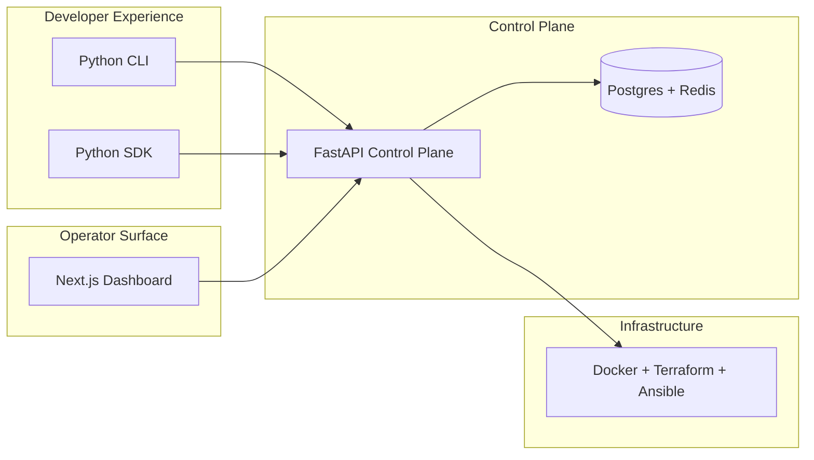

<p align="center">
  
</p>

<h1 align="center">MUTX: The Industrial Control Plane for AI Agents</h1>

<p align="center">
  <strong>Deploy, run, observe, and govern AI agents like you deploy services.</strong>
</p>

<p align="center">
  <a href="./MANIFESTO.md"><strong>Our Manifesto</strong></a> ·
  <a href="./WHITEPAPER.md"><strong>Technical Whitepaper</strong></a> ·
  <a href="https://mutx.dev"><strong>Live Preview</strong></a> ·
  <a href="./docs/README.md"><strong>Read Docs</strong></a> ·
  <a href="https://github.com/fortunexbt/mutx-dev"><strong>GitHub</strong></a>
</p>

---

## Start Here

- Read [the manifesto](./MANIFESTO.md) for the product thesis and design philosophy.
- Read [the technical whitepaper](./WHITEPAPER.md) for the system model, architecture, and roadmap framing.
- Read [the docs hub](./docs/README.md) for setup, workflows, and contributor-facing documentation.
- Visit [`mutx.dev`](https://mutx.dev) for the landing site and [`app.mutx.dev`](https://app.mutx.dev) for the operator surface preview.

---

## 🚀 The Thesis
Agentic AI is easy to prototype but notoriously hard to operate at scale. We are building the **industrial-grade operating system** for enterprise AI agents—providing the operational rigor required to take agentic projects from demo to production.

> **"If this looks like your kind of infrastructure, there is real work waiting. MUTX is the control plane people will actually build on."**

---

## 🏛️ The Infrastructure Gap

| Capability | The SaaS Wrapper Trap | MUTX Industrial Infrastructure |
| :--- | :--- | :--- |
| **Architecture** | Multi-tenant, shared cluster | **Single-tenant, bare-metal VPC** |
| **Persistence** | Ephemeral, timeout-capped | **24/7 autonomous runtime** |
| **Observability** | Console logs | **Unified metrics/tracing/alerts** |
| **Economics** | Predatory token-markup | **BYOK / Zero Margin** |

---

## 🏗️ Architecture At A Glance



---

## 🛠️ Developer-First Ergonomics

### The Operator Terminal
```bash
# Provision a hardened VPC for your agent swarm
$ mutx deploy --config ./agents/production.json --region us-east-1

# Monitor observability across global clusters
$ mutx status --agent-id 8829-44-202
```

### The SDK Interface
```python
from mutx import MutxClient

# Connect to your dedicated control plane
client = MutxClient(api_key="mutx_live_xxx")

# Spin up a specialized, persistent operator
agent = client.agents.create(
    name="Financial-Reconciliation-Bot",
    config='{"model": "gpt-4o-mini", "temp": 0.1}',
)

# Trigger a mission-critical task asynchronously
task = agent.run_task(
    instruction="Reconcile daily ledger against Stripe and Bank APIs",
    priority="high"
)
print(f"Autonomous agent operating: {task.id}")
```

---

## 🗺️ Roadmap & Maturity

| Phase | Focus | Status |
| :--- | :--- | :--- |
| **NOW** | Auth/Ownership, CLI/SDK Alignment, Dashboard UX | 🔥 In Progress |
| **NEXT** | Typed Agent Config, Lifecycle History, Webhook Surface | 🏗️ Planning |
| **LATER** | Traces API, Vector/RAG, Quota Enforcement | 🔭 Backlog |

---

## 🤝 Contributor Lanes
MUTX is at the stage where strong contributors can leave a visible mark on the product.

- **`area:web`**: Build a real, authenticated dashboard.
- **`area:api`**: Harden ownership and schema coverage.
- **`area:cli/sdk`**: Perfect the operator ergonomics.
- **`area:infra`**: Hardening deployment loops and monitoring.

---

## 🏁 Quickstart

```bash
# 1. Install dependencies
npm install
pip install -r requirements.txt

# 2. Start infra & services
docker-compose -f infrastructure/docker/docker-compose.yml up -d postgres redis
uvicorn src.api.main:app --reload --port 8000
npm run dev
```

---

*MUTX: Building the backbone of the agentic economy.*
