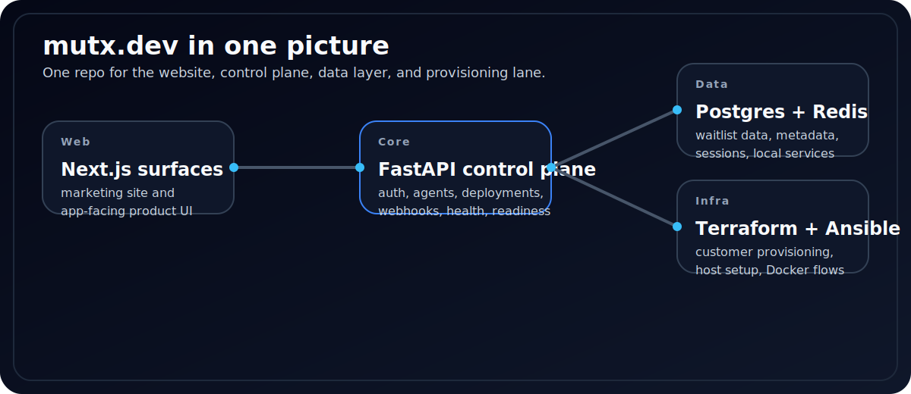

# MUTX

> Open-source MIT control plane for deploying and operating AI agents like systems, not demos.


MUTX brings the operator surfaces into one repository:

- a FastAPI control plane mounted under `/v1/*`
- a public browser demo at [`/app`](app/app/[[...slug]]/page.tsx)
- a Next.js site and app host
- a Python CLI and first-party Textual TUI
- a Python SDK
- local-first install and bootstrap flows for real operator setup

Most teams can already prototype an agent. Very few can run one with durable identity, deployment semantics, sessions, health, access control, and honest operator contracts. MUTX is the layer around the agent system that makes those concerns explicit.

## What MUTX Is

MUTX is an assistant-first control plane for AI operations.

Today the project already models and exposes the operational shell around agents:

- starter templates, including `personal_assistant`
- assistant overview, sessions, skills, channels, wakeups, and gateway health
- agents, deployments, runs, usage, webhooks, API keys, and auth routes
- a public dashboard demo that shows the intended operator surface
- a CLI and TUI aligned around `mutx setup`, `mutx doctor`, and assistant workflows
- shared local config and local operator bootstrap for contributor workflows

The core thesis is simple:

1. Deploy the assistant or agent as a real resource.
2. Operate it through durable control-plane records.
3. Keep the web surface, CLI, TUI, SDK, docs, and API contract speaking the same language.

## Current Surfaces

| Surface                   | Path / URL                                                | Current role                                              |
| ------------------------- | --------------------------------------------------------- | --------------------------------------------------------- |
| Public site               | `mutx.dev` / [`app/`](app)                                | Product narrative, quickstart, install path, metadata     |
| Public control-plane demo | [`/app`](app/app/[[...slug]]/page.tsx)                    | Browser demo of the MUTX operator shell                   |
| Docs                      | `docs.mutx.dev` / [`docs/`](docs)                         | Canonical setup, architecture, and contract documentation |
| Control plane API         | [`src/api/`](src/api)                                     | FastAPI backend and mounted `/v1/*` routes                |
| CLI + TUI                 | [`cli/`](cli) and root [`pyproject.toml`](pyproject.toml) | Terminal operator workflows                               |
| SDK                       | [`sdk/mutx/`](sdk/mutx)                                   | Python client access to the control plane                 |

## What Ships Today

### Control plane

- mounted public routes under `/v1/*`
- route groups for `auth`, `assistant`, `agents`, `deployments`, `templates`, `sessions`, `runs`, `usage`, `api-keys`, `webhooks`, `monitoring`, `budgets`, `rag`, `clawhub`, and more
- local and hosted operator setup paths
- database initialization, schema-repair, and background monitor wiring

### Assistant-first workflow

- `personal_assistant` starter template
- one-shot deploy flow through `mutx setup hosted` and `mutx setup local`
- assistant overview, session discovery, channel inspection, skill management, and gateway health
- workspace skill discovery and assistant config shaping in the control plane

### Operator surfaces

- public dashboard demo route under `/app`
- browser site and app shell in Next.js
- `mutx` CLI
- `mutx tui` Textual operator shell

### Delivery and operations

- installer at `https://mutx.dev/install.sh`
- local dev stack with `make dev-up`
- infrastructure references in Docker, Terraform, Ansible, and monitoring assets

## Quickstart

Canonical guide: [docs/deployment/quickstart.md](docs/deployment/quickstart.md)

### Hosted operator

Use this when you already have access to a MUTX control plane.

```bash
curl -fsSL https://mutx.dev/install.sh | bash
mutx setup hosted --open-tui
mutx doctor
mutx assistant overview
```

### Local contributor

Use this when you are working inside the MUTX repository.

```bash
git clone https://github.com/mutx-dev/mutx-dev.git
cd mutx-dev

npm install
python3 -m venv .venv
source .venv/bin/activate
pip install -r requirements.txt
pip install -e ".[dev,tui]"

make dev-up
mutx setup local --open-tui
mutx doctor
mutx assistant overview
```

Expected result in either lane:

1. authenticated operator state is stored in `~/.mutx/config.json`
2. `Personal Assistant` is deployed
3. runtime state is visible from the CLI, TUI, and browser surfaces

## Operator Contract

### Key routes

These are the core route families worth knowing first:

- `/v1/templates`
- `/v1/assistant`
- `/v1/sessions`
- `/v1/deployments`
- `/v1/agents`
- `/v1/auth`
- `/v1/webhooks`
- `/v1/api-keys`

### Core commands

```bash
mutx setup hosted
mutx setup local
mutx doctor
mutx assistant overview
mutx assistant sessions
mutx tui
```

### Shared local config

`mutx` and `mutx tui` reuse the same config shape in `~/.mutx/config.json`:

```json
{
  "api_url": "http://localhost:8000",
  "access_token": null,
  "refresh_token": null,
  "assistant_defaults": {
    "template": "personal_assistant",
    "runtime": "openclaw",
    "model": "openai/gpt-5"
  }
}
```

## Recent Progress

Recent work in the repository has materially changed what MUTX can show and prove:

- public control-plane demo shipped under `/app`
- installer handoff simplified and aligned with the assistant-first setup lane
- local operator auth bootstrap added for contributor workflows
- CLI and TUI centered around one-command setup and assistant inspection
- dashboard, landing, and docs moved closer to the same operational story



## Repository Map

```text
mutx-dev/
├── app/             # Next.js site, app host, and route handlers
├── cli/             # Python CLI and Textual TUI
├── docs/            # Setup, architecture, contracts, and troubleshooting
├── infrastructure/  # Docker, Terraform, Ansible, and monitoring assets
├── sdk/             # Python SDK
├── src/api/         # FastAPI control plane
└── tests/           # API, CLI, and frontend coverage
```

## Development

### Local stack

```bash
make dev-up
make dev-logs
make dev-stop
```

Useful local URLs:

- site and app host: `http://localhost:3000`
- public dashboard demo: `http://localhost:3000/app`
- API: `http://localhost:8000`
- API docs: `http://localhost:8000/docs`

### Validation

```bash
./scripts/test.sh
npm run build
pytest tests/test_cli_auth_and_tui.py tests/test_cli_setup_and_doctor.py
```

## TODO

Near-term contributor priorities are intentionally short and concrete:

- make the authenticated browser dashboard use live control-plane data end to end
- keep API, CLI, SDK, docs, and public site aligned with the mounted `/v1/*` contract
- finish durable deployment lifecycle history, events, and rollback posture
- turn webhook and API-key flows into complete product surfaces with clear operator UX
- expand local-first route, UI, and integration coverage in CI

## Documentation

- [docs/README.md](docs/README.md)
- [docs/deployment/quickstart.md](docs/deployment/quickstart.md)
- [docs/cli.md](docs/cli.md)
- [docs/architecture/overview.md](docs/architecture/overview.md)
- [docs/contracts/api/index.md](docs/contracts/api/index.md)
- [whitepaper.md](whitepaper.md)
- [ROADMAP.md](ROADMAP.md)

Hosted documentation: [docs.mutx.dev](https://docs.mutx.dev)

## Contributing

Start with:

- [CONTRIBUTING.md](CONTRIBUTING.md)
- [docs/project-status.md](docs/project-status.md)
- [ROADMAP.md](ROADMAP.md)

When docs and code disagree, trust the code first:

- [`src/api/routes/`](src/api/routes)
- [`app/api/`](app/api)
- [`cli/`](cli)
- [`sdk/mutx/`](sdk/mutx)

## License

MUTX is licensed under the [MIT License](LICENSE).
