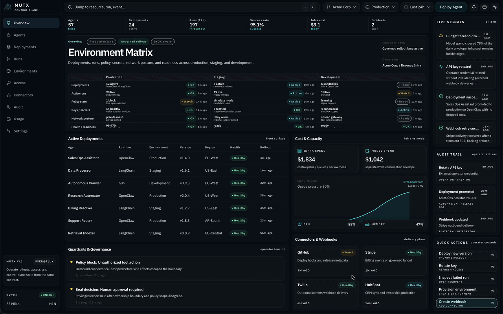

# MUTX

> Source-available control plane for running AI agents in production.



Prototype an agent in an afternoon. Run one in production for a year — that's the hard part. Identity, deployments, sessions, health, access control, operator contracts. MUTX makes those explicit in running code, not whitepapers.

## What's in the Box

| Component | What it does |
|-----------|-------------|
| **Control Plane API** | FastAPI backend — `/v1/*` routes for auth, agents, deployments, sessions, runs, webhooks, budgets, swarms, RAG, and pico progress |
| **Operator Dashboard** | Authenticated dashboard at `app.mutx.dev/dashboard` |
| **Landing Site** | `mutx.dev` — narrative, quickstart, downloads |
| **macOS App** | Signed & notarized desktop app via `mutx.dev/download/macos` |
| **CLI + TUI** | `mutx` CLI and `mutx tui` — terminal-first workflows |
| **Python SDK** | `pip install mutx` — full control plane access |
| **Document Workflows** | `predict-rlm`-backed document analysis, comparison, extraction, and redaction across API, dashboard, CLI, and worker |
| **Infrastructure** | Docker Compose (local), Terraform + Ansible (cloud), Helm (k8s) |

## Quick Start

```bash
brew tap mutx-dev/homebrew-tap && brew install mutx
mutx setup hosted
```

Hosted is the default. For the local Docker stack:

```bash
mutx setup local    # Docker-backed
mutx doctor         # Verify everything's wired
```

## Development

```bash
make dev-up                                  # full stack (frontend + backend + Postgres + Redis)
uvicorn src.api.main:app --reload --port 8000  # backend only
npm run dev                                    # frontend only
```

| URL | What |
|-----|------|
| `localhost:3000` | Landing site |
| `localhost:3000/dashboard` | Operator dashboard |
| `localhost:8000` | API |
| `localhost:8000/docs` | Swagger UI |

### Validation

```bash
./scripts/test.sh          # full suite
npm run build              # frontend build
npm run typecheck          # TS gate
ruff check src/api cli sdk # Python lint
pytest                     # API tests
npx playwright test        # e2e
```

## Architecture

```
mutx.dev ──────────── Next.js landing + releases + download
app.mutx.dev ──────── Dashboard + control demo + browser proxies
src/api/ ──────────── FastAPI control plane (/v1/*)
cli/ ──────────────── Click CLI + Textual TUI
sdk/mutx/ ─────────── Python SDK
infrastructure/ ───── Docker, Terraform, Ansible, Helm, monitoring
agents/ ───────────── Autonomous specialist agent definitions
```

Governance via [Faramesh](https://faramesh.dev) — policy enforcement, session budgets, phase workflows, credential brokering, rate limiting. Auth is RBAC + OIDC (Okta, Auth0, Azure AD, Keycloak).

## Go Deeper

- [Manifesto](docs/manifesto.md) — why control planes, not demos
- [Technical Whitepaper](docs/whitepaper.md) — architecture deep-dive
- [Roadmap](docs/roadmap.md) — what's next
- [API Reference](docs/api/reference.md) — `/v1/*` contract
- [CLI Guide](docs/cli.md) — terminal workflows
- [Document Workflows](docs/document-workflows.md) — `predict-rlm` requirements, API, CLI, dashboard, and worker
- [Python SDK](docs/sdk.md) — programmatic access
- [v1.4 Release Notes](docs/releases/v1.4.md) — latest release
- [v1.3 Release Notes](docs/releases/v1.3.md) — previous release
- [Contributing](CONTRIBUTING.md) — repo conventions
- [Infrastructure](docs/infrastructure.md) — deploy guide

## Built On

- [agent-run](https://github.com/builderz-labs/agent-run) — observability standard
- [AARM](https://github.com/aarm-dev/docs) — Autonomous Action Runtime Management
- [Faramesh](https://github.com/faramesh/faramesh-core) — governance engine
- [Mission Control](https://github.com/builderz-labs/mission-control) — fleet management
- [predict-rlm](https://github.com/Trampoline-AI/predict-rlm) — document workflow engine and upstream example surface for analysis, comparison, invoice extraction, and redaction

Full attribution in [CREDITS.md](CREDITS.md).

## License

Source-available under [BUSL-1.1](LICENSE). Each release converts to Apache-2.0 after 36 months. Python SDK is [Apache-2.0](sdk/LICENSE). See [LICENSE-FAQ](LICENSE-FAQ.md).

Commercial use (hosted, managed, OEM) requires a license — [hello@mutx.dev](mailto:hello@mutx.dev).
