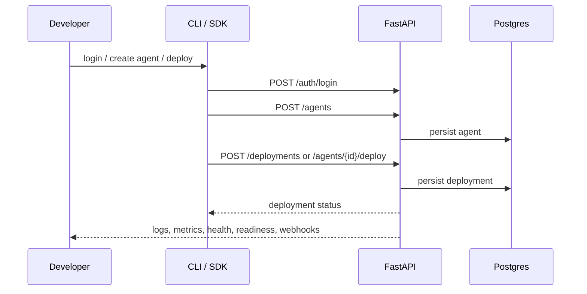

<p align="center">
  
</p>

# MUTX

> Deploy agents like services. Operate them like systems.

MUTX is an open-source control plane for AI agents.

It brings together the pieces teams actually need once an agent stops being a demo and starts becoming infrastructure: a website, a FastAPI backend, a Python CLI, a Python SDK, deployment primitives, API keys, webhooks, health checks, and a real path from local development to hosted operation.

This repo is not just a landing page and not just an agent wrapper.
It is the beginning of a full-stack operating surface for production-minded agent systems.

## Why This Exists

Most agent tooling is amazing at one of these things:

- orchestration
- prompt wiring
- local demos
- framework abstractions

Very little of it is opinionated about the boring, lethal, absolutely necessary production layer:

- who owns an agent
- who can deploy it
- how deployments are represented
- how webhooks get authenticated
- how API keys are rotated
- how health/readiness is exposed
- how a website, an API, a CLI, an SDK, and infra all stay aligned

That is the gap MUTX is attacking.

## What MUTX Actually Does

Today, this repository gives you:

- a Next.js web surface for the public site and waitlist
- a FastAPI control plane for auth, agents, deployments, API keys, and webhooks
- a Python CLI for login, status, agent operations, and deployment operations
- a Python SDK for agents, deployments, and webhooks
- Docker, Railway, Terraform, Ansible, Prometheus, and Grafana foundations
- a real Postgres-backed waitlist flow with Resend email sending on the site

That means the project already spans the entire outer shell around agent systems, even while parts of the runtime story are still being hardened.

## The USP

MUTX is not trying to win by being the cleverest orchestration abstraction.

MUTX wins if it becomes the layer around agent systems that makes them operable.

| Category | Typical agent tool | MUTX |
| --- | --- | --- |
| Core promise | orchestrate model/tool calls | operate agent systems end-to-end |
| Primary surface | framework / runtime abstraction | web + API + CLI + SDK + infra |
| Control plane concerns | often partial | first-class |
| Auth / ownership | inconsistent | explicit product lane |
| Deployments | often implied | modeled in API |
| API keys / webhooks | bolt-ons | native product surface |
| Infra story | externalized | in-repo |
| Contributor wedge | plugins/prompts | platform hardening |

In one line:

> MUTX is the control plane around the agent stack, not just another way to define the stack.

## Architecture At A Glance

```mermaid
flowchart LR
  Site[Next.js Website] --> Waitlist[/POST /api/newsletter/]
  Site --> Proxy[/app/api/api-keys/*/]
  CLI[Python CLI] --> API[FastAPI Control Plane]
  SDK[Python SDK] --> API
  API --> Auth[/auth]
  API --> Agents[/agents]
  API --> Deployments[/deployments]
  API --> Webhooks[/webhooks]
  API --> Keys[/api-keys]
  API --> PG[(Postgres)]
  API --> Redis[(Redis)]
  Infra[Terraform + Ansible + Docker + Railway] --> API
```

And the current happy-path looks like this:



## Visual Tour

### 1. The operator terminal

```bash
$ mutx login --email you@example.com
Logged in successfully!

$ mutx agents create --name recon-swarm --config '{"model":"gpt-4o-mini"}'
Created agent: 7f5e4e3b-a851-4d26-a779-f0e6a1fca3d7 - recon-swarm

$ mutx deploy list --limit 10
0f8d2d30... | 7f5e4e3b... | deploying | replicas: 1
```

### 2. The SDK surface

```python
from mutx import MutxClient

client = MutxClient(
    api_key="mutx_live_xxx",
    base_url="http://localhost:8000",  # explicit today while SDK defaults are being aligned
)

agent = client.agents.create(
    name="recon-swarm",
    description="nightly reconciliation",
    config='{"model":"gpt-4o-mini"}',
)

deployment = client.deployments.create(agent.id, replicas=1)
print(deployment.status)
```

### 3. The website waitlist is real

```bash
curl -X POST http://localhost:3000/api/newsletter \
  -H "Content-Type: application/json" \
  -d '{"email":"you@company.com","source":"homepage"}'
```

What happens:

- the signup is stored in Postgres when DB is available
- a Resend email is attempted using a template, with HTML fallback
- the route returns success for duplicate signups without duplicating rows

## Repo Map

| Path | What lives there |
| --- | --- |
| `app/` | Next.js App Router site, website APIs, global styles |
| `components/` | shared UI components including the waitlist form |
| `src/api/` | FastAPI backend, models, routes, services, auth, integrations |
| `cli/` | Python CLI commands for auth, agents, deployments |
| `sdk/` | Python SDK for agents, deployments, webhooks, runtime client foundations |
| `infrastructure/` | Terraform, Ansible, monitoring, validation helpers |
| `docs/` | setup, architecture, API, deployment, troubleshooting |

## What Is Real Today

Grounded in the codebase right now:

- `POST /auth/register`, `POST /auth/login`, `POST /auth/refresh`, `GET /auth/me`
- password reset, email verification, and resend-verification flows
- `POST /agents`, `GET /agents`, `GET /agents/{id}`, `DELETE /agents/{id}`
- `POST /agents/{id}/deploy`, `POST /agents/{id}/stop`
- `GET /agents/{id}/logs`, `GET /agents/{id}/metrics`
- `GET /deployments`, `POST /deployments`, `POST /deployments/{id}/scale`, `POST /deployments/{id}/restart`, `DELETE /deployments/{id}`
- `GET /deployments/{id}/logs`, `GET /deployments/{id}/metrics`
- API key lifecycle under `/api-keys`
- webhook registration and webhook ingestion under `/webhooks`
- health and readiness endpoints at `/health` and `/ready`
- website-side waitlist capture at `POST /api/newsletter`

## Reality Check

MUTX is ambitious, but the repo is most useful when described honestly.

Things to know before you build on it:

- the FastAPI app does **not** use a global `/v1` prefix
- the web surface is stronger than the current app dashboard
- the SDK and CLI are useful, but some defaults and flows are still being aligned to the real API contract
- the roadmap is about hardening and convergence, not pretending the platform is already done

That honesty is a strength, not a weakness.

## Quickstart

### 1. Install frontend dependencies

```bash
npm install
```

### 2. Install backend dependencies

```bash
python3 -m venv .venv
source .venv/bin/activate
pip install -r requirements.txt
pip install -e ".[dev]"
```

### 3. Configure environment

```bash
cp .env.example .env
```

### 4. Start local services

```bash
docker-compose up -d postgres redis
uvicorn src.api.main:app --reload --port 8000
npm run dev
```

### 5. Verify the stack

```bash
curl http://localhost:8000/
curl http://localhost:8000/health
curl http://localhost:8000/ready
```

## CLI Examples

```bash
mutx status
mutx login --email you@example.com
mutx whoami
mutx agents list --limit 10
mutx deploy list --limit 10
```

## API Examples

Register a user:

```bash
curl -X POST http://localhost:8000/auth/register \
  -H "Content-Type: application/json" \
  -d '{"email":"you@example.com","name":"You","password":"StrongPass1!"}'
```

Create an agent:

```bash
curl -X POST http://localhost:8000/agents \
  -H "Authorization: Bearer YOUR_ACCESS_TOKEN" \
  -H "Content-Type: application/json" \
  -d '{
    "name": "My First Agent",
    "description": "Local test agent",
    "config": "{\"model\":\"gpt-4o-mini\"}"
  }'
```

Create a deployment:

```bash
curl -X POST http://localhost:8000/deployments \
  -H "Authorization: Bearer YOUR_ACCESS_TOKEN" \
  -H "Content-Type: application/json" \
  -d '{
    "agent_id": "YOUR_AGENT_ID",
    "replicas": 1
  }'
```

## Infrastructure Story

MUTX already includes the operational skeleton most repos leave out:

- Docker Compose for local stack orchestration
- Railway configs for hosted web/API deployment
- Terraform for infrastructure provisioning
- Ansible for server provisioning and deployment
- Prometheus and Grafana configs for monitoring

If you want to work on the boring-but-important parts of agent infrastructure, this repo is very much your kind of playground.

## Roadmap

The roadmap is intentionally short and grounded.

### Now

- auth and ownership on `/agents` and `/deployments`
- CLI, SDK, and API contract alignment
- real dashboard basics
- contact and API key workflows
- testing and CI
- easier local bootstrap

### Next

- typed agent config instead of string blobs
- deployment events and lifecycle history
- webhook registration as a real product surface
- monitoring and self-healing wired into runtime behavior
- better app-side observability views

### Later

- execution and traces API for agent runs
- versioning, rollback, and deploy history UX
- quotas and plan enforcement
- vector / RAG feature completion
- expanded runtime support

See `ROADMAP.md` and `docs/project-status.md` for the full contributor-oriented view.

## Contributors We Need

This is the fun part.

MUTX is already at the stage where strong contributors can leave a visible mark on the product.

| Lane | What to work on |
| --- | --- |
| `area:web` | real dashboard UX, authenticated data views, landing/page polish |
| `area:api` | ownership checks, schema cleanup, tests, deployment lifecycle work |
| `area:cli` | fix create/deploy ergonomics, improve auth experience |
| `area:sdk` | align defaults and supported methods with the live API |
| `area:testing` | backend route coverage, local-first Playwright, CI trust |
| `area:docs` | keep examples, commands, architecture, and screenshots aligned |
| `area:infra` | validation, deployment hardening, monitoring loops, backup confidence |

If you like products that feel like a real machine instead of a weekend demo, this is that kind of repo.

## Documentation

- developer portal: `docs/README.md`
- architecture: `docs/architecture/overview.md`
- API reference: `docs/api/index.md`
- quickstart: `docs/deployment/quickstart.md`
- CLI guide: `docs/cli.md`
- roadmap: `ROADMAP.md`
- contributor process: `CONTRIBUTING.md`

## Source Of Truth Notes

When docs disagree:

- trust `src/api/routes/` for API behavior
- trust `cli/` for CLI behavior
- trust `sdk/mutx/` for SDK behavior
- trust `app/api/newsletter/route.ts` for the waitlist contract

## Status

MUTX is early, real, and actively being hardened.

That is exactly why it is interesting.

The bones are here.
The surface area is meaningful.
The roadmap is sharp.
And the upside is obvious if the control plane gets as good as the ambition.

## License

MIT. See `LICENSE`.
