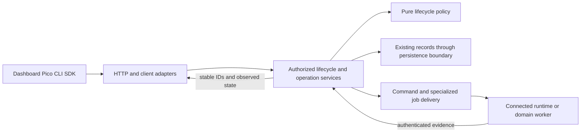
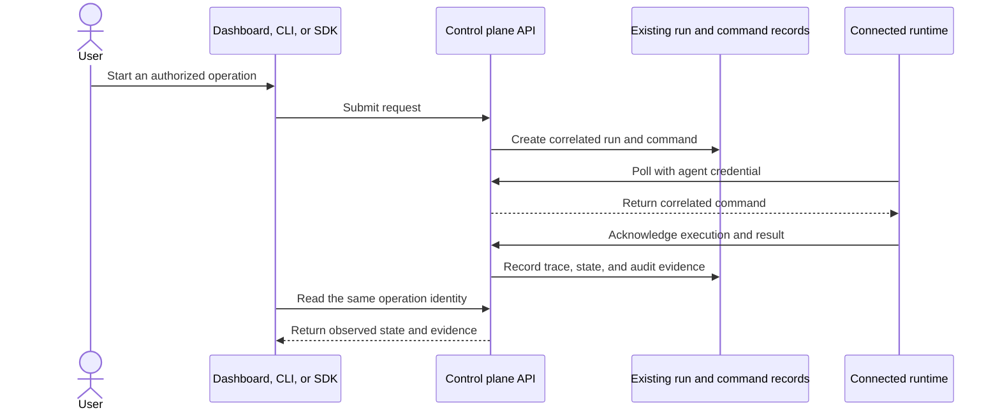
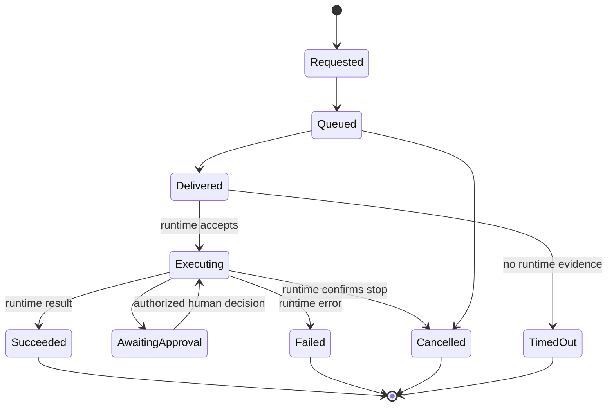
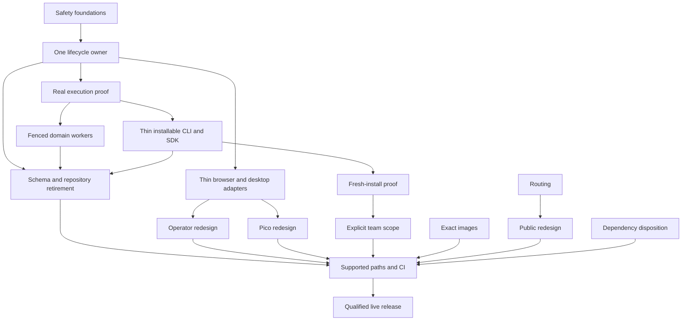

# MUTX Product Revival - Plan

## Goal Capsule

- **Objective:** People can reach MUTX, install or connect a supported runtime, create and operate an agent, inspect real execution evidence, and keep their access and data intact.
- **Means:** Rebuild a small core behind preserved public contracts, delete the implementations it supersedes, then finish the product experiences and qualify delivery (KTD7).
- **Authority:** User scope and visual direction govern the product contract. Current source, tests, manifests, and live checks govern existing behavior. Preserve current authentication, user data, route contracts, package identities, and Pico progress. Production, DNS, billing, credential, or irreversible data actions stop at a reviewable owner gate.
- **Execution profile:** Code work in a clean rebuild worktree based on the integrated revival branch. Each U-ID is an independently reviewable replacement with named retirements. Do not copy changes from the dirty legacy checkout without reconciling them against current source and tests.
- **Stop conditions:** Do not call a run active or successful without evidence from the connected runtime or worker. Do not declare a release from a local build alone. Hold a deployment if the configured host, release artifact, data migration, or approval boundary cannot be verified.
- **Completion:** Keep the long-running goal open until every U-ID and the Definition of Done pass. The product owner reviews the redesigned screens and the production release candidate before publication.

---

## Product Contract

### Summary

Rebuild MUTX around connecting an agent, inspecting its state and runs, requesting a supported action, and verifying its outcome. Replace competing implementations as each core behavior moves to one owner. Keep individual, team, and Pico entry points, then finish their redesign and delivery against that core.

### Problem Frame

The public domain currently returns a maintenance page with HTTP 503. The app and API domains return Railway fallback 404s, so users cannot reach the advertised product even though the source builds locally. The latest public desktop release has no downloadable assets.

The repository has accumulated overlapping execution paths, route catalogs, command handlers, page orchestration, and maintenance automation. Working product flows coexist with separate run records and status handlers that report `RUNNING` after writing a database row. A dashboard redesign alone would leave users unable to tell whether a runtime actually acted. Existing install documentation also names different paths and does not consistently match the published CLI package boundary.

The current site, dashboard, and Pico visual design do not meet the requested quality bar. Their replacement must make MUTX's real product legible while keeping authentication, API contracts, routes, user data, and Pico learning state intact.

### Requirements

**Audience and experience**

- R1. Support individual developers, teams, and PicoMUTX as first-class audiences with entry points suited to each audience and a coherent shared control plane.
- R2. Rebuild the visual system, layout, navigation, and product copy from scratch across the public site, dashboard, and Pico surfaces. Do not treat the current orange, serif, editorial, or brutalist styling as a constraint; give the dashboard a clear operating hierarchy rather than a generic card grid.
- R3. Give the public site a cinematic, continuous reveal with a tangible CSS3D MUTX console or device hero and pinned chapters mapped to real product states. Use actual product screens and concise, truthful copy. Design mobile as its own composition rather than compressing the desktop sequence.
- R4. Preserve authentication, existing user data, public routes, API behavior, CLI and SDK package identities, and Pico onboarding, checkout, locale, lesson, and progress continuity while changing the presentation.

**Product operation and trust**

- R5. A supported user can install or connect a runtime, create or register an agent, start a real operation, inspect its evidence, and stop or govern it through the supported product surfaces.
- R6. Show desired state, reported data, and observed runtime state distinctly. Mark work active or successful only after a runtime, provider, or worker acknowledgement supports the claim.
- R7. Make the same operation and stable identifier discoverable across its authorized API, CLI, SDK, and dashboard surfaces. Link Pico package and local execution evidence when a supported runtime is connected. Keep legacy endpoints and command names compatible until their consumers have a tested migration path.
- R8. Give team resources an explicit membership and authorization boundary. Keep existing personal data private by default; sharing requires an explicit membership or resource action.

**Delivery and maintainability**

- R9. Restore working public, app, and API entry points and make published availability claims match verified deployed behavior.
- R10. Rebuild the core with one owner for each behavior and audit every tracked top-level area. Each replacement must retire its competing implementation after caller, data, license, URL, package, and migration checks; optional features must have a retained user workflow or an explicit retirement decision.
- R11. Keep dependency locks, container builds, documentation, generated API types, CI, release artifacts, and deployed services aligned with the supported product path.
- R12. Review each maintained direct dependency against its supported upstream line. Upgrade compatible releases, and document compatibility holds with evidence; keep major migrations separate from visual redesign work.

### Key Decisions

- Audience scope: individual developers, teams, and PicoMUTX are first-class (session-settled: user-directed — chosen over selecting one primary audience: the user replied “EVERYTHING” after the audience choices were surfaced). Governs R1, R4, R5, R7, R8.

- Core rebuild and pruning (session-settled: user-approved — chosen over continuing layered patches: the user approved a smaller rebuild that strips accumulated bloat). Governs R5–R7, R10, R11.

### Success Criteria

- `mutx.dev` serves the rebuilt public product, `app.mutx.dev` serves the dashboard, and `api.mutx.dev/health` reaches the intended API. Each check returns from the configured live service, without a maintenance response or Railway fallback page.
- A fresh supported install reaches one successful run from a connected runtime. The same run ID, output, status, and audit evidence agree across the API, CLI, SDK, and dashboard.
- A command is not shown as complete before its runtime acknowledgement. A stop or approval changes the actual execution outcome and leaves an attributable record.
- A team member cannot read or control a resource outside their membership. Existing accounts and their data remain accessible in personal scope after migration.
- The public site, dashboard, and Pico have distinct, redesigned desktop and mobile compositions. Direct navigation, authentication, checkout, lesson completion, and browser console checks still pass.
- Required local and hosted CI gates pass. Fixable critical/high dependency advisories are resolved; advisories without a fix remain explicitly assessed and disclosed. Every maintained direct dependency is current on a compatible release line or has a documented evidence-backed hold.
- The agent/deployment lifecycle, dashboard route identity, supported CLI actions, and schema upgrade path each have one canonical owner. Retired paths have no active production callers. Source reduction is reported against the tracked baseline by area, without treating generated files or tests as product-code savings.
- The release has working public links and verified download artifacts. A rendered or locally built screen does not count as a published result.

### Actors

- A1. Individual developer: installs or connects an agent, configures providers, and operates personal agents and runs.
- A2. Team operator or member: shares authorized resources, reviews approval requests, and works within membership permissions.
- A3. Pico learner or operator: follows local setup, generates a package, continues lessons, and requests help without losing progress.
- A4. MUTX maintainer: supports releases, deployed services, authentication, and customer-facing documentation.

### Key Flows

- F1. Discover and install: a user enters through the public site or Pico, selects a documented supported lane, completes setup, checks readiness, and sees one inspectable result. Missing keys, unsupported hosts, unavailable services, interrupted installs, and package failures must have clear outcomes.
- F2. Operate a connected agent: an authorized user creates or registers an agent, dispatches work through a supported runtime, sees authenticated execution evidence, then stops or requests approval for a consequential action.
- F3. Collaborate: a user joins a workspace, accesses only shared resources allowed by membership, and leaves or is removed with access revoked. Personal data stays private unless shared explicitly.
- F4. Resume Pico setup: a learner installs or builds a package, records lesson proof, encounters an error or sign-in transition, then resumes without losing progress or duplicating a request.
- F5. Verify availability: a visitor loads the marketing page and docs; an operator opens the app and health endpoint; each host routes to its intended service and reports its real availability.

### Acceptance Examples

- AE1. Given the production domains are configured, when a user opens the homepage, dashboard, and API health URL directly, each serves its intended page or health response and no host falls through to maintenance or Railway's default 404.
- AE2. Given a connected agent and an authorized user, when the user starts a run, the agent receives and acknowledges the command, the same run is visible through the dashboard and API, and the UI does not report success before the acknowledgement.
- AE3. Given a command is retried before acknowledgement, when the agent polls again, MUTX does not create a second user-visible operation or accept a stale worker's completion as the current result.
- AE4. Given two users in separate personal workspaces, when either requests the other's agent, run, session, approval, key, or artifact, authorization denies the request. Joining a shared workspace grants only the permissions assigned there.
- AE5. Given a Pico learner reloads, changes locale, signs in, or retries a failed package build, when they return to the lesson, the latest valid progress and request identity remain available.
- AE6. Given desktop and mobile viewport captures of each redesigned surface, the site reveal remains understandable at reduced motion, dashboard controls remain operable, and Pico's local setup path remains visible without horizontal overflow.

### Scope Boundaries

**In scope**

- Public marketing and documentation, Next.js dashboard and BFF, FastAPI routes/services/models, agent command and job workers, API schema and generated types, CLI and SDK, Pico site/API/content, desktop and Capacitor shells, install/build/package scripts, container and cloud deployment definitions, CI workflows, and release packaging.
- A full visual reset for the public site, dashboard, and Pico. The product site uses the requested cinematic reveal. The dashboard remains an operational workspace, and Pico remains a guided local setup and learning experience.
- A repository-wide keep, merge, replace, or retire disposition for every top-level area. This does not impose a file-count target or justify unrelated edits.

**Non-goals for this goal**

- A new agent orchestration engine, an independent run store, or a third party-specific control plane when current command and run contracts can be extended.
- A general visual workflow canvas or a copy of any competitor's full platform. Competitor capabilities are evidence for run durability, inspection, human control, and install quality, not a feature checklist.
- Unreviewed paid services, new commercial dependencies, credential entry, billing changes, DNS changes, production publishing before U13’s owner-reviewed cutover, or destructive data changes.

**Deferred to follow-up work**

- A standalone MCP facade or additional natural-language workflow layer after the existing API action and permission contracts are stable.
- Further autonomous recovery beyond verified existing monitoring, after runtime-backed retry and worker-fencing evidence exists.
- Kubernetes or Terraform expansion beyond audited, explicitly supported deployment targets. Unsupported examples may be relabeled or retired after downstream use and state ownership are checked.

### Dependencies

- Production Vercel/Railway project and domain ownership must be confirmed before live routing changes. Build and review against a local or preview URL first; keep current custom domains unchanged until U13's release gate.
- The GitHub account billing lock currently prevents some hosted checks from starting. Remote CI is a release gate only after the owner restores eligibility; do not mislabel a billing-blocked job as a code failure.
- The local Docker daemon is unavailable while its startup requests administrator-level configuration. The exact Railway and local images must still build in CI or another approved Docker host.

---

## Planning Contract

### Key Technical Decisions

- KTD1. **Keep the connected-agent command boundary as an adapter to the rebuilt core.** The repository already has agent-key-authenticated poll and acknowledgement routes. No production command producer was found. Use that boundary for the first real execution path instead of adding an execution engine. Give each operation one stable execution identity and correlate it with the existing `AgentRun`/trace contract; keep `MutxRun` as its distinct observability, cost, provenance, and evaluation record. Preserve both API families until their current callers and stored histories have tested projections or migrations.
- KTD2. **Use runtime evidence for lifecycle state.** Agent registration, deployment creation, and monitor/auto-heal paths can set database status without provisioning or executing work. A database write means requested or recorded state. A verified runtime heartbeat, command receipt, provider acknowledgement, or worker result means observed state. Keep this distinction in each API response and UI status treatment.
- KTD3. **Replace the visual language while preserving behavior.** Build and review the public site, dashboard, and Pico locally or on a preview before any production cutover. The public site gets the Civico Due quality reference: a continuous, scroll-linked reveal with pinned chapters and a tangible MUTX console/device object, using actual MUTX pages as the content. Dashboard and Pico get purpose-built layouts under shared semantic tokens. Their route, auth, API, state, and mobile behavior remain product contracts. The Civico reference supplies choreography and craft only, not copy or business claims.
- KTD4. **Delete competing implementations when moving ownership.** Use the disposition table below to consolidate route identity, request parsing, CLI handlers, and lifecycle writers. Compatibility entry points delegate to the canonical owner; they do not carry a second implementation. Extract a large component only when the extracted module owns a coherent action or data lifecycle. (R4, R10.)
- KTD5. **Make the maintained full-stack deployment path authoritative.** `infrastructure/docker/` and the scripts that use it are the current local stack; the root `Dockerfile` and `docker-compose.yml` are legacy copies. Fix the Python ABI copy path and gate the exact Railway and local images before retiring legacy files. Do not equate syntax validation with a built image.
- KTD6. **Fence durable jobs before sharing their code or scaling workers.** Document and reasoning workers have similar lifecycle code but different job tables and drivers. First prove one worker owns a job, stale claimants cannot write results, and external effects are idempotent. Share only mechanics that survive that proof.

- KTD7. **Rebuild the core in place behind existing adapters.** Create framework-independent lifecycle policy and one database-backed transition owner. HTTP routes handle authorization and wire translation; executors report evidence; clients consume the public contract. Start in a clean worktree, reuse characterized auth and persistence, and remove superseded branches within each replacement. This creates no second server, database, run store, dependency-injection framework, or universal renderer. (R4–R7, R10, R11; session-settled: user-approved — chosen over adding repairs to competing implementations: a smaller core is the approved direction.)
- KTD8. **Separate operation records by authority.** `AgentRun`/trace owns user-visible operation evidence, `Command` owns delivery, document/reasoning jobs own specialized execution and claims, and `MutxRun` owns runtime-emitted observability. Domain services map their transitions to the run envelope transactionally. Preserve reported-run ingestion and both histories; correlation does not turn a caller-supplied status into execution proof. (KTD1, R6, R7.)
- KTD9. **Enforce boundaries with small architecture checks.** Pure lifecycle policy imports neither HTTP, ORM, CLI, nor UI modules. API routes do not implement lifecycle transitions. Published CLI/SDK packages do not import backend `src` for a claimed installed capability. `mutx-cli` remains BUSL-1.1; SDK `mutx` remains Apache-2.0. Tests enumerate the transitional exceptions and remove each when its owner moves. (R4, R10, R11.)
- KTD10. **Make local CLI execution honest before packaging an engine.** Installed CLI local document/reasoning modes fail before creating work if the optional engine is absent. Source-tree execution remains explicit until a separately reviewed installable engine earns inclusion. Do not bundle backend dependencies into the CLI to preserve an inaccurate installation claim. (R4–R7, R10.)

### Ownership and retirement map

The tracked-text audit at `a047b7fe` counted 795 product source files / 183,221 lines, separately from 91,601 test lines, 75,986 generated/lock lines, and 10,648 repository-automation lines. These are an audit baseline, not a promise that 70% can be deleted. Each completed unit records removed owners, remaining callers, and net source change outside this decision document.

| Area / current paths | Keep / canonical owner | Replace or delete | Retirement evidence / unit |
|---|---|---|---|
| `src/api/routes/agents.py`, `deployments.py`, `agent_runtime.py`, `ingest.py`, `services/monitor*.py` | Existing auth, IDs and endpoints; one lifecycle policy and transition service | Route-local status writers, timer-based provisioning, synthetic heartbeats and fake restart/rollback recovery | Real heartbeat/provider evidence, stop/restart characterization, no competing status writers; U14 |
| `services/agent_runtime.py`, `integrations/langchain_agent.py` | Governed tool execution and documented embedding contracts where actually used | Unwired process-local runtime/registry paths after transferring retained governance behavior | Production, tests, examples and docs caller audit; U17 |
| `AgentRun`, `Command`, `DocumentJob`, `ReasoningJob`, `MutxRun` | Authority split in KTD8 | Duplicate transition mechanics only after fenced domain contracts pass | Same operation IDs, independent histories, stale-worker safety; U7, U10 |
| `src/api/database.py`, migration versions | Alembic as schema-upgrade authority; configured sessions as persistence boundary | Competing startup schema repair/creation in production after legacy DB fixtures migrate | Empty/current/legacy upgrade and repeatability, restore/backfill proof; U17 |
| `lib/dashboardPanels.ts`, desktop route config, dashboard navigation | One route identity catalog; desktop owns its presentation metadata | Handwritten reverse path/panel/nav maps | Every alias, nested route, SPA exclusion and desktop stage preserved; U15 |
| `lib/store.ts`, dashboard SPA boot, `components/app/http.ts` | Workspace UI preferences and existing JSON transport | Uncalled store fetch/boot actions; duplicate parsers and redundant shell inventory requests | Caller search and request/auth/error contracts; U15 |
| `app/api/dashboard/`, `app/api/pico/` | Existing authenticated transport; domain-specific aggregates; shared approval contract | Duplicate approval validation and proxy bodies | Both URL namespaces, refresh cookies and Pico conflict semantics; U15 |
| `components/desktop/`, `desktop/` | Bridge/main/preload capabilities; feature-owned remote request logic | Giant native route switch cases as their feature owner takes over | Native-vs-browser behavior, bridge and route tests; U5, U15 |
| `app/pico/`, `components/pico/`, `lib/pico/`, `i18n/`, `messages/` | Learner progress, localization, checkout and package proof | Duplicated content sources and mixed orchestration as canonical content/workflow owners move | Persisted progress, locale, package and entitlement parity; U6, U17 |
| `cli/` | Canonical `auth`, `agent`, `deployment` handlers; documented local adapters | Duplicate flat/plural command bodies; backend imports from installed-only paths | Flags/defaults/output and clean-wheel smoke; aliases become thin dispatchers; U16 |
| `sdk/` | Licensed SDK distributions and resource contracts | Repeated sync/async payload and response shaping; unused required instrumentation | Both execution modes, clean install and optional-extra contracts; U16 |
| `agents/`, `autonomy_stubs/`, `scripts/autonomy/`, repository-agent CI | No default claim to be product runtime | Retire uncalled abandoned maintenance jobs, stubs and agent scaffolding | Workflow/cron/import/external use inventory, retained capability justification; U17 |
| `infrastructure/`, root Docker/Compose, `nginx.conf`, Railway/Vercel config | One qualified local stack and current hosted deployment path | Duplicate build definitions and unsupported templates after state/use checks | Exact image builds, supported matrix, infrastructure-state checks; U2, U12, U17 |
| `android/`, `ios/`, Capacitor, Electron packaging | Existing native identities and one shared UI/domain contract | Native copies of remote business behavior | Bridge/build/install evidence and platform caller audit; U5, U11, U13 |
| `app/`, `components/site/`, `public/`, `lib/docs.ts` | Public URLs, truthful examples and one maintained visual system | Obsolete redesign variants, stale assets, competing copy/data definitions | Link/render and asset-use evidence; U4, U17 |
| `docs/`, `examples/`, `contributing/`, `homebrew-tap/`, root docs | Supported install/API/license/release contracts | Stale unsupported instructions and examples after their replacements verify | Clean install, mounted routes, release bytes; U8, U12, U17 |
| `tests/`, `scripts/`, `.github/`, root manifests/config | Behavior, distribution, security and release gates | Tests enshrining retired fake behavior and obsolete automation, after replacement tests exist | No weakened auth/concurrency contracts; audit every remaining tracked top-level area; U17 |

Unlisted tracked top-level paths are inventoried in U17 before release. A large file, an old date, or a failed text search alone is insufficient deletion evidence.

### Assumptions

- MUTX remains a source-available agent control plane with local/self-hosted and hosted use. This plan does not change its product identity.
- Existing account records begin in private personal scope. If no external trusted membership source exists, introduce the smallest first-party workspace/membership mapping required for team operations.
- Reuse current authenticated principals, roles, approval rules, usage entitlements, and package names. Do not grant a new role or approval entitlement by default.
- The first real execution path uses a connected agent already supported by MUTX. If source and installed artifacts cannot prove an existing runtime can execute an operation, record that as a blocker for the runtime unit rather than substituting a simulator.
- The authoritative supported deployment and install matrix may change after clean image and published-artifact checks. Keep unsupported deployment files visible until that evidence is gathered.

### High-Level Technical Design

The target rebuilds core ownership while preserving external contracts. This sketch describes boundaries; implementations may use existing modules where they satisfy KTD7–KTD9.

The connected-agent protocol must distinguish delivery from execution and return evidence before the control plane changes its user-visible state.

The operation lifecycle distinguishes accepted intent from runtime evidence. Existing observations and imported runs remain identifiable as reported data.

A stop request or approval decision is not complete when the API accepts it. The UI remains pending until the authorized runtime or worker confirms the resulting state.

Local and preview work can continue while billing or production-project access is being resolved. U13 owns the live cutover.

### Alternatives Considered

- **Keep layering repairs onto competing implementations:** rejected by the approved core-rebuild decision (KTD7). It retains the ownership problem that caused abandonment.
- **Discard all data, auth, clients, and history in a big-bang rewrite:** rejected under R4. Rebuild core behavior from scratch in staged replacements while retaining proven contracts and migration paths.
- **Build a separate execution engine or visual workflow platform:** deferred. The current repository has a connected-agent command protocol, worker-backed document/reasoning jobs, and distinct run records. A new engine would duplicate those ownership boundaries before the existing path has a real producer.
- **Copy a competitor feature matrix:** rejected. Current competitors separate runtime from control plane and emphasize durable traces, resumable execution, and human review. Dify's visual platform requires a 15-service Docker Compose stack and has a modified source license; that is not a suitable Pico installation baseline. Focus on MUTX's complete install-to-control path instead.

### Implementation Unit Index

| Unit | Outcome | Primary files | Depends on |
|---|---|---|---|
| U1 | Close fixable package advisories | `package.json`, Python lock files | — |
| U2 | Build the exact supported container images | Dockerfiles, Compose, CI | U1 |
| U3 | Prepare safe public routing in local/preview builds | `next.config.mjs`, `proxy.ts`, tests | U1 |
| U4 | Rebuild the public product story | `components/site/marketing/`, `tests/website.spec.ts` | U1, U3 |
| U5 | Rebuild the dashboard experience | `components/dashboard/`, `components/desktop/` | U7, U15 |
| U6 | Rebuild the Pico experience | `app/pico/`, `components/pico/`, Pico tests | U7, U15 |
| U7 | Make connected-agent execution real and visible | agent, command, run, deployment routes | U14 |
| U8 | Make fresh install and client contracts reliable | CLI, SDK, installer, docs | U7, U16 |
| U9 | Add team membership without exposing personal data | models, authorization, migrations | U7, U8 |
| U10 | Fix worker ownership and extract shared mechanics | job services, workers, concurrency tests | U7 |
| U11 | Modernize and disposition dependency families | npm, Python, desktop, Capacitor manifests | U1 |
| U12 | Declare supported paths and restore required CI | AGENTS, deployment docs, manifests, CI | U2–U11, U14–U17 |
| U13 | Publish the verified site and release artifacts | release workflows, artifact verification, live domains | U12 |
| U14 | Rebuild agent/deployment lifecycle ownership | lifecycle policy/service, monitor and routes | U1 |
| U15 | Consolidate browser/desktop route and transport owners | route registry, store, approvals BFF | U14 |
| U16 | Consolidate installable client implementations | CLI handlers, SDK resources | U7 |
| U17 | Retire competing schema and repository systems | migrations, database bootstrap, caller inventory | U14, U10, U16 |

### Phased Delivery

1. **Architecture replacements first:** Verify U1’s safety prerequisite, then U14, then U7, U15 and U16. Freeze new feature work while each behavior gains one owner and its old implementation is removed. Previously completed safety/routing/visual work remains available, but it does not satisfy these structural gates.
2. **Durable execution and retirement:** U10 and U17. Fence specialized workers, make one schema-upgrade path authoritative, and remove abandoned product/automation systems with recorded compatibility evidence.
3. **Finish the product on that core:** Verify U3 routing before completing public U4 work; execute U5, U6, U8 and U9 in dependency order. Preserve all audiences while minimizing duplicated implementation. Complete U4's remaining public surfaces against verified behavior.
4. **Qualify delivery:** U2, U11 and U12. These safety and packaging tasks may continue independently; release waits for their actual image/client/CI evidence.
5. **Live release:** U13, after every prerequisite and the owner-reviewed cutover candidate pass.

### System-Wide Impact

- **Authentication and data:** `User`, agent keys, sessions, approvals, API keys, traces, job rows, and Pico progress have distinct ownership rules. Team membership must not reuse a telemetry `workspace_id` as an authorization boundary or widen access through caller-supplied IDs.
- **API and client contracts:** `app/api/`, `src/api/`, `docs/api/openapi.json`, `app/types/api.ts`, `cli/`, and `sdk/` move together. Generate and check contracts after route changes.
- **User experience:** the public reveal, dashboard, Pico, Electron, and Capacitor shells use different route entry points. Share visual tokens while preserving each surface's navigation, responsive behavior, and core workflows.
- **Operations:** Railway, Docker Compose, desktop packaging, Helm, Kubernetes manifests, Terraform, and release workflows do not currently have one support level. Declare the supported matrix before claims or cleanup.
- **Contributors:** `AGENTS.md` and older UI-port and deployment documents contain stale paths or versions. Update them from manifests and active workflow files rather than preserving outdated instructions.

### Risks and Mitigations

- **A green build hides a broken public host.** Build and review the replacement against local and preview URLs first. Keep the current domain assignments unchanged until U13 verifies the replacement project and API health, then make the owner-reviewed cutover.
- **A redesign implies execution that did not occur.** Use fixture data only when it is labelled illustrative. Use observed status and provenance for live data, and do not release a completion screen before runtime evidence exists.
- **A workspace migration widens access.** Backfill personal scope first, compare per-user row counts and access decisions, and keep cross-user tests for agents, runs, sessions, approvals, keys, logs, and artifacts.
- **Retries duplicate work or accept stale results.** Use atomic worker claims and current claim tokens before retry or scale-out. Test two workers racing for one job and a stale claimant attempting finalization.
- **Mobile choreography obscures the product.** Build a separate mobile composition; test direct routes, reduced motion, viewport fit, and actual task completion on small screens.
- **CI and local container verification are constrained.** GitHub billing currently blocks some jobs, and local Docker requires an unavailable administrator configuration. Preserve local source gates and run the exact image builds in eligible CI before release.
- **Unfixed advisories remain.** The Python lock audit found fixable `urllib3` findings and no published fix for the current `diskcache` and `ecdsa` versions. Patch `urllib3`; keep the others visible until source-path exposure and mitigation are evidenced.

### Documentation and Operational Notes

- Make `infrastructure/docker/docker-compose.yml` and its setup scripts the one documented full-stack local entry point. Decide a one-release shim or deprecation note before removing the root-level Docker copies.
- Pin `public/install.sh` fallback to a published CLI release, update stale `cli-v1.3.0` examples, and explain that `mutx-cli` provides the `mutx` command while `mutx` is also the separate SDK package.
- Correct local-run instructions for the CLI wheel, because the wheel excludes backend `src/` while `doctor` and local document execution import it.
- Update `AGENTS.md`, `docs/ui-port-progress.md`, deployment docs, API reference, and examples only after reconciling each statement with manifests, mounted routes, and tested behavior.
- Re-enable the required CI workflows after the account billing lock is resolved. Keep billing-blocked CodeQL or other jobs classified as unavailable, not green or failed code checks.
- Treat release notes, signed artifacts, checksums, remote bytes, and live host verification as separate release gates. Do not call v1.4.0 downloadable until its assets exist and verify.

### Sources and Research

**Repository evidence**

- Host routing and page surfaces: `proxy.ts`, `app/page.tsx`, `app/dashboard/`, `app/pico/`, `app/docs/`, `components/site/marketing/`, `components/dashboard/`, `components/desktop/desktopRouteConfig.ts`, `lib/dashboardPanels.ts`.
- Runtime and records: `src/api/routes/agent_runtime.py`, `src/api/routes/runs.py`, `src/api/routes/observability.py`, `src/api/routes/deployments.py`, `src/api/models/models.py`, `src/api/models/observability_models.py`, `src/api/services/deployment_lifecycle.py`.
- Worker and migration boundaries: `src/api/services/document_jobs.py`, `src/api/services/reasoning_jobs.py`, `src/api/document_worker.py`, `src/api/reasoning_worker.py`, `src/api/models/migrations/versions/`, `src/api/database.py`.
- Setup and distributions: `cli/commands/onboard.py`, `cli/commands/setup.py`, `cli/commands/agent.py`, `cli/commands/agents.py`, `sdk/mutx/`, `pyproject.toml`, `sdk/pyproject.toml`, `public/install.sh`.
- Key compatibility suites: `tests/website.spec.ts`, `tests/dashboardRouteMatrix.spec.ts`, `tests/picoAcademyCompletion.spec.ts`, `tests/test_cli_current_api_contract.py`, `tests/test_sdk_distribution.py`, `tests/test_python_dependency_contract.py`, `tests/test_railway_runtime_contract.py`.
- Deployment source distinguishes active scripts from stale copies: `scripts/dev.sh`, `infrastructure/docker/`, `Dockerfile`, `docker-compose.yml`, `railway.json`, `.github/workflows/ci.yml`, `.github/workflows/release.yml`.

**Live and release evidence, checked 2026-09-30**

- `https://mutx.dev` serves a maintenance page with HTTP 503; `https://app.mutx.dev` and `https://api.mutx.dev/health` return Railway fallback 404s.
- The `mutx-maintenance` project owns `mutx.dev` and `www.mutx.dev`; the production Vercel app project has only its generated domain, has no custom domain, and is not connected to Git.
- The latest public GitHub release is `v1.4.0` and has no assets. Required GitHub actions are blocked by an account billing lock; several local workflows are manually disabled.
- The Railway and local API Dockerfiles install under Python 3.12 but copy Python 3.11 site-packages. Existing CI checks syntax or builds a different API image, leaving the active images unproved.

**External landscape**

- LangGraph uses durable checkpoints and human review, while LangSmith separates deployment modes from the orchestration framework: [LangGraph persistence](https://docs.langchain.com/oss/python/langgraph/persistence), [LangSmith deployment modes](https://docs.langchain.com/langsmith/deployment).
- OpenAI separates its application-owned Agents SDK from a managed Agents API and documents tracing and repeatable evaluation: [Agents SDK](https://developers.openai.com/api/docs/guides/agents/sdk), [Agents API architecture](https://developers.openai.com/api/docs/guides/agents-api/architecture), [Agents API tracing](https://developers.openai.com/api/docs/guides/agents-api/tracing), [agent evaluations](https://developers.openai.com/api/docs/guides/agent-evals).
- CrewAI supports persisted, resumable flows and human feedback, with managed production controls in a separate enterprise surface: [CrewAI flows](https://docs.crewai.com/v1.15.23/en/concepts/flows), [human-in-the-loop](https://docs.crewai.com/v1.15.23/en/learn/human-in-the-loop), [CrewAI release activity](https://github.com/crewAIInc/crewAI/releases).
- Dify's Docker Compose self-host path starts 15 services and requires a larger host footprint than Pico's simple local lane; its source license is not equivalent to MIT or Apache: [Dify self-host quick start](https://docs.dify.ai/en/self-host/deploy/quick-start/docker-compose), [Dify license](https://github.com/langgenius/dify/blob/main/LICENSE).

---

## Implementation Units

### U1. Close fixable dependency advisories

- **Goal:** Keep the current frontend security fixes and remove fixable Python lock advisories before public release.
- **Requirements:** R9, R11.
- **Dependencies:** None.
- **Files:** `package.json`, `package-lock.json`, `scripts/check-js-dependency-compat.mjs`, `requirements-runtime.lock`, `requirements-ci.lock`, `uv.lock`, `tests/test_python_dependency_contract.py`.
- **Approach:** Preserve the current Next.js 16.3.8 and lockfile compatibility changes. Raise `urllib3` to the fixed 2.8.0 release through the repository's lock workflow. Keep the current no-fix `diskcache` and `ecdsa` advisories visible until their reachable code paths and mitigations are assessed.
- **Patterns to follow:** `scripts/check-js-dependency-compat.mjs`, hash-locked requirements files, `uv.lock`, and `tests/test_python_dependency_contract.py`.
- **Test scenarios:**
  - A clean lock resolution keeps Next.js, glob, and `urllib3` at patched versions without changing the CLI or SDK package identity.
  - The dependency contract check reports mismatched runtime, CI, or uv lock declarations.
  - A separate fresh dependency audit confirms the fixed `urllib3` version and keeps no-fix `diskcache` and `ecdsa` findings visible in the release assessment; the compatibility checker is not treated as an advisory scanner.
- **Verification:** The frontend compatibility check and Python dependency contract pass. A fresh dependency audit has no unresolved fixable critical/high advisory.
- **Execution note:** This is packaging and lock work; verify fresh resolution and runtime imports before changing application code.

### U2. Make container and deployment contracts buildable

- **Goal:** Build the actual Railway backend and supported local stack from the same locked Python environment.
- **Requirements:** R9, R11.
- **Dependencies:** U1.
- **Files:** `Dockerfile`, `docker-compose.yml`, `infrastructure/docker/Dockerfile.backend`, `infrastructure/docker/Dockerfile.api`, `infrastructure/docker/Dockerfile.api.production`, `infrastructure/docker/docker-compose.yml`, `infrastructure/docker/docker-compose.prod.yml`, `railway.json`, `.github/workflows/ci.yml`, `scripts/dev.sh`, `scripts/setup.sh`, `tests/test_railway_runtime_contract.py`, `tests/test_frontend_container_contract.py`, `tests/test_package_manager_contract.py`, `tests/unit/python/test_ci_workflow_contract.py`.
- **Approach:** Fix the Python 3.12 versus Python 3.11 site-packages copy mismatch. Build the Dockerfiles actually selected by Railway and local development in CI. Use the `infrastructure/docker/` Compose stack for local full-stack setup. Retire the root `Dockerfile` and `docker-compose.yml` only after their consumers are checked and a one-release shim or deprecation note is in place.
- **Patterns to follow:** The current scripts and production Compose migration service, plus lock-based dependencies in `requirements-runtime.lock`.
- **Test scenarios:**
  - The Railway-selected image imports the API successfully from a clean built image.
  - The local Compose stack starts the API, frontend, migration, Postgres, and Redis services from the supported command.
  - The legacy root compose entry point still has a clear migration path until its compatibility window ends.
- **Verification:** CI builds and starts the exact Railway and local images. A `docker build --check` result alone does not satisfy this unit.

### U3. Prepare safe public routing for local and preview builds

- **Goal:** Make standalone routing and host behavior testable without changing production domain assignments.
- **Requirements:** R9, R11.
- **Dependencies:** U1.
- **Files:** `next.config.mjs`, `vercel.json`, `proxy.ts`, `tests/unit/nextConfig.test.ts`, `tests/website.spec.ts`, `tests/releaseFrontend.spec.ts`, `scripts/verify-release-http.mjs`, `scripts/run-release-web-smoke.sh`.
- **Approach:** Keep Next same-origin dashboard API routes from being rewritten to `/` when the upstream API URL is unset. Include Markdown docs and required fonts in standalone output. Exercise the intended public, app, and API host behavior on local and preview URLs. Do not reassign `mutx.dev`, `www`, `app.mutx.dev`, or `api.mutx.dev` in this unit; preserve the maintenance project until U13 proves the replacement.
- **Patterns to follow:** `proxy.ts`, standalone release smoke scripts, and the active Vercel/Railway configuration after provider ownership is confirmed.
- **Test scenarios:**
  - Next routes preserve same-origin `/api/*` behavior when the API URL is absent and proxy to the configured service when present.
  - A standalone build serves docs Markdown and its fonts.
  - Direct browser visits to the local or preview public home, docs, dashboard, and API health reach the expected owner with no fallback response.
- **Verification:** Local and preview URL smoke passes. U13 owns the later real custom-domain HTTP/browser check; do not infer domain health from this unit's build.
- **Execution note:** The Docker daemon is currently unavailable in the local environment, so prove the image through eligible CI or another approved Docker host.

### U4. Rebuild the public product story

- **Goal:** Replace the public site's visual system and copy with the requested product-led cinematic reveal.
- **Requirements:** R1–R4, R9.
- **Dependencies:** U1, U3.
- **Files:** `app/page.tsx`, `app/download/`, `app/releases/`, `app/docs/`, `components/site/marketing/`, `components/site/docs/`, `lib/docs.ts`, `tests/website.spec.ts`, `tests/releaseFrontend.spec.ts`.
- **Approach:** Create a tangible CSS3D MUTX control-console or device hero with pinned chapters that map one-to-one to real agent operations. Use actual dashboard and Pico screens, and replace the current copy and visual treatment. Give mobile a separate shorter composition with the same product story and working links. Build against local or preview URLs; keep unqualified runtime claims out of the public copy until U7 passes.
- **Patterns to follow:** Existing canonical routes and branded documentation renderer as behavior references only; do not preserve their visual treatment.
- **Test scenarios:**
  - The homepage chapter sequence exposes the install, run inspection, and control paths using real routes.
  - Download, release, docs, public auth, and Pico links remain reachable after direct navigation.
  - The mobile composition fits a 390px viewport and reduced-motion mode retains every chapter's content.
  - Browser console, hydration, and remote asset checks remain clean.
- **Verification:** Review rendered desktop and mobile captures at the actual browser size. The user approves the visual direction before the redesigned site is treated as complete. This review does not require public domain cutover.

### U5. Rebuild dashboard and desktop operations

- **Goal:** Give operators a coherent console for agents, deployments, runs, sessions, and approvals.
- **Requirements:** R1, R2, R4–R7.
- **Dependencies:** U7, U15.
- **Files:** `app/dashboard/`, `components/app/AgentsPageClient.tsx`, `components/app/DeploymentsPageClient.tsx`, `components/dashboard/`, `components/desktop/desktopRouteConfig.ts`, `components/desktop/DesktopNativeRoutePage.tsx`, `lib/dashboardPanels.ts`, `tests/dashboardRouteMatrix.spec.ts`, `tests/dashboardAgents.spec.ts`, `tests/unit/dashboardAggregateTruth.test.ts`, `tests/unit/dashboardContinuity.test.ts`, `tests/unit/dashboardPanels.test.ts`, `tests/unit/dashboardSpaPanelHost.test.ts`, `tests/unit/desktopRouteMatrix.test.ts`.
- **Approach:** Replace the navigation, typography, layout, and page composition while retaining direct URLs, aliases, authentication boundaries, browser routes, feature-flagged SPA routing, and Electron local-runtime controls. Use U15’s canonical route identity and transport owners. Break the large desktop route switch into modules by existing responsibility; do not delete pages because they appear unused in one search. Build and review from local or preview services while production remains on its current domains.
- **Patterns to follow:** `DashboardRouteBoundary`, current route-matrix behavior, typed API clients, and the Electron preload bridge for privileged operations.
- **Test scenarios:**
  - A signed-out user is redirected correctly, and a forbidden or failed lookup shows the correct state.
  - Direct links and aliases for agent detail, deployment detail, runs, sessions, and approvals render the same resource after reload.
  - Desktop native controls remain behind the preload bridge and browser routes do not invoke privileged actions.
  - Small-screen navigation and actions remain usable without horizontal overflow.
  - A caller-reported run remains visibly reported/imported; only authenticated runtime evidence can render an executing or successful state.
- **Verification:** Desktop and mobile route-matrix tests pass, and screenshots show a redesigned operator console with actual route data. A polished fixture does not prove real operation status; U7 owns that proof.

### U6. Rebuild Pico as a guided product surface

- **Goal:** Give Pico a clear, compact local setup and learning experience under the new visual system.
- **Requirements:** R1–R4, R6.
- **Dependencies:** U7, U15.
- **Files:** `app/pico/`, `components/pico/`, `lib/pico/`, `app/api/pico/`, `tests/picoAcademyCompletion.spec.ts`, `tests/picoCheckout.spec.ts`, `tests/website.spec.ts`, `tests/unit/picoOnboardingContinuity.test.ts`, `tests/unit/picoLessonWorkspace.test.ts`, `tests/unit/picoFrontendRecoveryContracts.test.ts`.
- **Approach:** Build a distinct Pico composition that shares semantic tokens with the main site but keeps its guided setup and learning feel. Redesign mobile as a local-first flow. Preserve locale selection, auth return paths, package generation, checkout branches, persisted proof, tutor/support handoff, and safe retry behavior.
- **Patterns to follow:** Current Pico persistence and request-identity contracts; current UI is a behavior reference, not a visual reference.
- **Test scenarios:**
  - A learner resumes persisted progress after reload, sign-in, and locale switch.
  - A package build failure can be retried without duplicate request or session state.
  - Checkout cancellation or entitlement denial returns to Pico with the correct state.
  - Tutor, support, and Autopilot keep the learner's current setup evidence visible and do not claim to execute commands on the user's machine.
  - Desktop and mobile screenshots show the separate Pico composition without hiding the next successful setup step.
- **Verification:** The Academy completion, checkout, onboarding continuity, and mobile route flows pass. Rendered desktop and mobile results receive product review.

### U7. Connect a real agent run to the command protocol

- **Goal:** Create one working end-to-end operation whose command, runtime result, audit record, and user-visible run identity agree.
- **Requirements:** R5–R7, R11.
- **Dependencies:** U14.
- **Files:** `src/api/models/models.py`, `src/api/routes/agent_runtime.py`, `src/api/routes/agents.py`, `src/api/routes/deployments.py`, `src/api/routes/runs.py`, `src/api/services/deployment_lifecycle.py`, `src/api/models/observability_models.py`, `src/api/routes/observability.py`, `app/api/dashboard/`, `components/dashboard/RunsPageClient.tsx`, `cli/commands/`, `sdk/mutx/`, `app/api/pico/`, `components/pico/`, `tests/api/test_agent_runtime_contract.py`, `tests/api/test_deployments.py`, `tests/api/test_runs.py`, `tests/api/test_observability.py`, `tests/api/test_approvals.py`, `tests/api/test_approval_enforcement.py`, `tests/api/test_audit_authorization.py`, `tests/api/test_agent_command_run_lifecycle.py` (new), `tests/test_sdk_agent_runtime_contract.py`, `tests/test_cli_runtime_commands.py`, `tests/unit/picoAutopilotDataContracts.test.ts`, `tests/picoAcademyCompletion.spec.ts`, `tests/dashboardAgents.spec.ts`.
- **Approach:** Apply KTD1, KTD8 and U14’s lifecycle owner to the authenticated command poll/ack protocol. Implement the producer and lease-backed listener against the canonical lifecycle owner. Correlate a new execution to the existing run identity, keep reported observability records distinguishable, and add only the smallest migration needed for correlation or delivery fencing. Mark registration, deployment request, delivery, active execution, approval wait, and terminal result distinctly. Require runtime evidence before reporting active or successful. Send stop and approved actions through the same authorized runtime boundary. Qualify the callback runner in `sdk/mutx/agent_runtime.py` and the planned CLI listener in `cli/services/agent_runtime.py` separately. The CLI’s first allow-listed action is `openclaw.health`; it proves a read-only action, not stop/approval. Before expanding that allowlist, bind each additional action to an executor capability and explicit target; unsupported actions remain unavailable. Leased operations require `leased-v1` capability, stable operation identity and fenced acknowledgement. At-least-once delivery requires replay-safe handlers and is not a promise of exactly-once effects.
- **Patterns to follow:** Agent-key ownership and agent ID checks in `agent_runtime.py`, existing `AgentRun`/trace and audit records, and persisted approval enforcement. Do not use the simulated OpenClaw deployment provider as execution proof.
- **Test scenarios:**
  - A user creates or registers a supported connected agent, starts a run, and its agent-key-authenticated poll receives exactly one operation with a stable run ID.
  - A runtime acknowledgement updates the same run and trace visible through the API, SDK, CLI, and dashboard; a rejected command produces a failed result.
  - A repeated poll or acknowledgement does not create a second operation or let a stale result overwrite a newer attempt. A legacy worker receives its existing protocol; a leased operation directed to an incompatible worker has an explicit unavailable/upgrade outcome.
  - If execution succeeds and acknowledgement is lost, replay keeps the same operation identity and the handler’s documented idempotency boundary.
  - A stop request changes the connected runtime state, and an approval-required operation pauses until a separate authorized human decision.
  - A provider or runtime that is absent or disconnected leaves the operation pending, failed, or timed out with a truthful message rather than `RUNNING`.
  - Pico can link to the shared run identity when a connected runtime supplies evidence; when none is connected, its guide does not claim that the learner's machine executed the command.
- **Verification:** One connected runtime performs an operation, returns acknowledgement and result, and the same run is inspectable and controllable through a supported client. Route mocks alone do not qualify.
- **Execution note:** Characterize the current register/poll/ack and deployment paths before changing state semantics.

### U8. Make fresh setup and CLI/SDK use reliable

- **Goal:** Make each documented install path reach a real, inspectable first result and clarify CLI, SDK, and backend boundaries.
- **Requirements:** R1, R4–R7, R11.
- **Dependencies:** U7, U16.
- **Files:** `README.md`, `docs/quickstart.md`, `docs/cli.md`, `docs/sdk.md`, `docs/document-workflows.md`, `docs/deployment/quickstart.md`, `docs/deployment/cli-release.md`, `public/install.sh`, `cli/commands/doctor.py`, `cli/commands/onboard.py`, `cli/commands/setup.py`, `cli/services/documents.py`, `cli/commands/agent.py`, `cli/commands/agents.py`, `sdk/mutx/`, `examples/langchain_agent.py`, `tests/test_install_script.py`, `tests/test_cli_distribution.py`, `tests/test_sdk_distribution.py`, `tests/test_cli_current_api_contract.py`, `tests/test_cli_agents_contract.py`, `tests/test_sdk_agents_contract.py`, `tests/test_sdk_async_resources_contract.py`, `sdk/tests/test_route_inventory.py`, `tests/test_sdk_examples.py` (new).
- **Approach:** Document the current Homebrew, PyPI CLI, SDK, repository, and hosted setup routes without calling them the same package. Pin the installer fallback to a tagged release. Apply KTD10 to local engine capability and use U16’s canonical command handlers. Make `doctor` report the installed runtime's actual capabilities. Correct the batch-iterator description and fix examples that cannot run. Preserve old command families until every command, flag, output, and API route has a tested successor.
- **Patterns to follow:** `tests/test_cli_current_api_contract.py`, the independent `mutx-cli` and SDK release lanes, and the sync/async SDK contract tests.
- **Test scenarios:**
  - A clean supported install runs `mutx onboard`, reports readiness from an installed capability, connects an agent, and reaches the U7 first result.
  - A release installer fallback uses the tagged artifact, never unreleased `main`.
  - A published CLI wheel reports local-engine absence truthfully and does not advertise a command it cannot execute.
  - Documented SDK and LangChain examples run in an isolated install against documented API credentials.
  - The old `agent`/`agents` and `deploy`/`deployment` commands continue to route or return a documented deprecation response until their output and behavior are migrated.
- **Verification:** A clean supported installation reaches U7, and generated docs, examples, CLI and SDK contract checks pass.

### U9. Add team membership without widening personal access

- **Goal:** Let teams share selected MUTX resources with explicit membership while preserving private personal scope for existing accounts.
- **Requirements:** R1, R4, R8, R11.
- **Dependencies:** U7, U8.
- **Files:** `src/api/models/models.py`, `src/api/models/approval.py`, `src/api/models/observability_models.py`, `src/api/auth/dependencies.py`, `src/api/security.py`, `src/api/routes/agents.py`, `src/api/routes/sessions.py`, `src/api/routes/approvals.py`, `src/api/routes/api_keys.py`, `src/api/models/migrations/versions/`, `app/api/dashboard/`, `sdk/mutx/`, `cli/`, `tests/api/test_session_tenant_isolation.py`, `tests/api/test_approval_enforcement.py`, `tests/api/test_workspace_tenant_isolation.py` (new), `components/dashboard/` workspace-access client, `tests/workspaceMembership.spec.ts` (new), `tests/test_migrations.py`, `tests/test_database_runtime_repair.py`.
- **Approach:** Add the smallest workspace and membership model that the in-product team flow needs. Give every current account a private personal scope first. Backfill existing agents, deployments, runs, sessions, approvals, keys, and linked jobs while retaining IDs, owner bindings, and session verification. Provide a compact dashboard flow for workspace creation, invitations, acceptance, role visibility, shared-resource access, and leaving/removal. Keep pending, denied and failed changes explicit. Require explicit membership or sharing for team access. Apply current roles and approval entitlements at workspace scope; do not treat an optional observability `workspace_id` as authorization.
- **Patterns to follow:** Current `require_roles` principal resolution, user ownership helpers, `tests/api/test_session_tenant_isolation.py`, and the session HMAC ownership contract.
- **Test scenarios:**
  - An existing user migrates to personal scope with the same agent/run/session IDs, history, keys, and accessible data.
  - A member can perform only the actions allowed by their workspace role and existing plan entitlement.
  - Through the dashboard, an authorized operator creates shared scope and an invitation; the invited member accepts and sees their role. Empty membership, pending/denied invitations and failed mutations have explicit outcomes; leaving/removal revokes access.
  - A removed member loses access to shared records and keys without changing another member's personal data.
  - A caller-supplied foreign workspace ID cannot reveal or reassign a resource.
  - An interrupted or repeated migration produces no duplicate membership and preserves row counts.
- **Verification:** Migration and API tests prove every current row remains accessible to its original owner, and a separate member can access only explicit shared scope.
- **Execution note:** Take and verify a pre-migration backup before running any backfill against user data.

### U10. Fence background jobs before refactoring workers

- **Goal:** Prevent concurrent document or reasoning workers from executing or finalizing the same job.
- **Requirements:** R5, R6, R10, R11.
- **Dependencies:** U7.
- **Files:** `src/api/services/document_jobs.py`, `src/api/services/reasoning_jobs.py`, `src/api/document_worker.py`, `src/api/reasoning_worker.py`, `src/api/models/`, `tests/api/test_queue_worker_supervision.py`, `tests/api/test_documents.py`, `tests/api/test_reasoning.py`, `tests/api/test_queue_worker_concurrency.py` (new).
- **Approach:** Add an atomic claim and owner token to queued jobs. Fence heartbeat, event, artifact, and terminal writes with the current token. Preserve document and reasoning schemas and drivers. Extract a shared lifecycle helper only after both services pass the same concurrency contract. Claim fencing protects database writes; it does not guarantee provider-side idempotency. Before redispatching an ambiguous external request, require an idempotent provider operation or reconcile its outcome. Otherwise retain an explicit unknown outcome and do not automatically repeat the request.
- **Patterns to follow:** Existing claim-token and stale-running recovery fields, adapted so claim ownership reaches finalization.
- **Test scenarios:**
  - Two workers racing for the same queued job yield one active claimant.
  - A stale claimant cannot write an event, artifact, or terminal result after a new claim takes ownership.
  - A long-running job renews ownership; an abandoned job becomes reclaimable only after its lease expires.
  - A retried external operation uses a stable attempt identity and does not duplicate the side effect. If the first provider request may have succeeded before persistence failed, an unsupported-idempotency provider is not automatically called a second time.
- **Verification:** Concurrent worker tests show one owner at a time and no stale writes. Existing supervision, document, and reasoning tests retain their domain behavior.
- **Execution note:** Add characterization coverage before extracting shared worker code.

### U11. Modernize and disposition dependency families

- **Goal:** Bring maintained direct dependencies up to tested supported lines or document why an update is held.
- **Requirements:** R11, R12.
- **Dependencies:** U1.
- **Files:** `package.json`, `package-lock.json`, `pyproject.toml`, `sdk/pyproject.toml`, `requirements-runtime.lock`, `requirements-ci.lock`, `uv.lock`, `capacitor.config.ts`, `reports/revival/baseline/npm-outdated.json`, `tests/test_python_dependency_contract.py`, `tests/test_cli_distribution.py`, `tests/test_sdk_distribution.py`, `tests/test_release_workflow_contract.py`.
- **Approach:** Review every maintained direct dependency against its supported upstream line, using the saved JavaScript inventory and all maintained Python, desktop, and mobile manifests. Upgrade compatible patch/minor releases. Run major migrations such as Electron, Capacitor, Framer Motion, and TypeScript as focused compatibility changes; otherwise record the hold and evidence. Do not combine package-major migrations with visual redesign work or treat an audit-clear lock as proof that dependencies are current.
- **Patterns to follow:** Lock generation and compatibility contracts for each package family; retain independent CLI, SDK, Electron, and Capacitor build boundaries.
- **Test scenarios:**
  - Each updated dependency resolves from the appropriate lock or package manifest without changing the published CLI/SDK identities.
  - Electron upgrades still produce both supported architectures and pass launch checks.
  - Capacitor upgrades build the maintained Android and iOS shells without changing app entry behavior.
  - TypeScript and React family changes pass typecheck, unit tests, and the existing application build.
  - Every direct dependency is current on a tested compatible line or has a named hold with evidence.
- **Verification:** The maintained dependency inventory has no unexplained stale direct package. Patch/minor upgrades pass their owning contracts; major migrations pass dedicated platform tests or remain explicitly held.

### U12. Declare supported paths and restore required CI

- **Goal:** Leave current source, contributor instructions, user docs, and hosted checks aligned with the install and deployment paths that passed qualification.
- **Requirements:** R9–R11.
- **Dependencies:** U2–U11, U14–U17.
- **Files:** `AGENTS.md`, `docs/ui-port-progress.md`, `docs/deployment/`, `docs/api/openapi.json`, `app/types/api.ts`, `.github/workflows/ci.yml`, `infrastructure/kubernetes/`, `infrastructure/helm/`, `infrastructure/terraform/`, `tests/test_deploy_manifest_truth.py`, `tests/test_frontend_container_contract.py`, `tests/test_python_dependency_contract.py`.
- **Approach:** Publish a support matrix from images and clients actually verified. Remove or relabel stale manifests only after checking repository consumers, external links, and Terraform state. Update agent instructions, API types, and user docs from current manifests and mounted routes. Re-enable required CI only after billing eligibility returns.
- **Patterns to follow:** Current package manifests, scripts/dev.sh, validated deployment configurations, and generated OpenAPI contracts.
- **Test scenarios:**
  - The documented local setup matches the exact full-stack image build that passed U2.
  - Generated OpenAPI types match the mounted routes and SDK/CLI inventories.
  - An unsupported Kubernetes or Terraform example is labeled accurately or retired only after its consumers and state are checked.
  - Required CI workflows start after account eligibility returns; billing-blocked jobs remain classified as unavailable.
- **Verification:** User and contributor docs describe only tested product paths. Required remote checks pass or have an explicit external owner blocker.

### U13. Publish the verified site and release artifacts

- **Goal:** Publish a truthful MUTX release with working product domains and downloadable, verified artifacts.
- **Requirements:** R9, R11.
- **Dependencies:** U12.
- **Files:** `.github/workflows/release.yml`, `desktop/scripts/release-artifact-utils.js`, `tests/test_release_workflow_contract.py`, `tests/releaseFrontend.spec.ts`, `scripts/verify-production-release.sh`, `scripts/verify-release-http.mjs`.
- **Approach:** Derive desktop artifact names from one manifest. Keep signing, notarization, launch, remote-byte, publication, and live-host checks as separate gates. Confirm provider ownership and preview the replacement before changing domain assignments. Preserve a rollback target.
- **Patterns to follow:** Existing immutable release identity, checksum, signature, notarization, and HTTP verification scripts.
- **Test scenarios:**
  - The release workflow creates the exact supported desktop files and the package, recovery, and publish jobs read the same manifest.
  - Downloaded remote bytes match the release checksums and signature policy.
  - The public, app, and API domains reach the intended services after cutover; HTTP and browser smoke pass on the actual domains.
  - The rollback target restores the previous truthful service if a host or artifact check fails.
- **Verification:** Signed artifacts, verified remote bytes, active domains, and download paths all work. The owner reviews the concrete preview and rollback path before the production cutover.

### U14. Rebuild agent and deployment lifecycle ownership

- **Goal:** Make requested actions and authenticated runtime evidence converge on one transition owner.
- **Requirements:** R4–R7, R10, R11; KTD2, KTD7–KTD9.
- **Dependencies:** U1.
- **Files:** `src/api/domain/lifecycle.py` (new), `src/api/services/deployment_lifecycle.py`, `src/api/services/monitoring.py`, `src/api/services/monitor.py`, `src/api/routes/agents.py`, `src/api/routes/deployments.py`, `src/api/routes/agent_runtime.py`, `src/api/routes/ingest.py`, `tests/api/test_ingest.py`, models/migrations and generated contracts when additive intent fields are required, `docs/adr/006-agent-runtime-architecture.md`, `tests/api/test_lifecycle_authority.py` (new), `tests/api/test_agents.py`, `tests/api/test_deployments.py`, `tests/api/test_agent_runtime_contract.py`, monitor tests, `tests/test_architecture_boundaries.py` (new).
- **Approach:**
  1. Characterize each current writer, principal, record, executor and completion signal. Start by deleting monitor-based fake provisioning and recovery; keep genuine stale-heartbeat detection and monitor supervision.
  2. Implement pure evidence/transition policy and move persistent state changes into the existing lifecycle service. Route, ingest and monitor adapters call that owner; remove their inline transition branches. Ingest submissions retain their wire contracts as reported data and cannot overwrite observed state without authenticated executor evidence.
  3. Preserve wire IDs and supported request shapes. Represent desired action separately from observed state through additive fields; use a monotonic target revision on intent, commands and qualified runtime observations. Bind deployment evidence to an explicit deployment ID, and preserve old rows without inventing historical evidence. Agent-wide stop targets all active deployments; deployment actions target one. Derive the agent observation from current target-bound deployments rather than whichever row was created last.
  4. Preserve authenticated runtime heartbeats and real provider acknowledgements. A command-listener heartbeat proves connectivity, not running agent work or deployment readiness. Legacy unbound heartbeats remain liveness reports and cannot override a newer intent or promote an unrelated deployment. Unsupported provider operations return a truthful pending/unavailable result; no simulator substitutes for an executor.
  5. Enforce the moved boundary and supersede the historical runtime ADR with current authority.
- **Execution note:** Begin with failing behavioral tests that an old creating/failed agent cannot become running merely because time passed. Commit bounded replacements with their retired paths rather than accumulating a second implementation.
- **Test scenarios:**
  - Covers AE2. Deployment creation without an executor records intent and cannot claim running or synthesize a heartbeat/node ID.
  - An authenticated runtime heartbeat changes the owned agent and eligible deployment; a listener heartbeat cannot mark provisioning complete.
  - A stale real heartbeat marks the observation unavailable/failed, emits one attributable event, and never auto-restores running after a delay.
  - Covers AE3. A stop/restart intent or late/unbound heartbeat cannot overwrite a newer target revision; explicit stop remains pending until executor confirmation.
  - With multiple deployments, stopping or restarting one cannot revive an agent-wide stop or overwrite another deployment’s observation.
  - Existing stored IDs, owner authorization, version history and foreign-user denial survive the replacement.
- **Verification:** One transition service owns active agent/deployment state writes. No production monitor can synthesize execution or recovery. Boundary checks and affected API/monitor/migration contracts pass; qualified executor outcomes are distinguished from recorded intent.

### U15. Consolidate browser and desktop adapters

- **Goal:** Remove competing route identity, dead store network paths and duplicated approval transport.
- **Requirements:** R4, R7, R10, R11; KTD4, KTD7, KTD9.
- **Dependencies:** U14.
- **Files:** `lib/dashboardPanels.ts`, `components/desktop/desktopRouteConfig.ts`, `components/dashboard/dashboardNav.ts`, `lib/navigation.ts`, `lib/store.ts`, `components/dashboard/dashboardSpaBoot.ts`, `components/dashboard/DashboardSpaPanelHost.tsx`, `components/app/http.ts`, `app/api/dashboard/approvals/`, `app/api/pico/approvals/`, shared approval contract, `tests/unit/dashboardPanels.test.ts`, `tests/unit/desktopRouteMatrix.test.ts`, `tests/unit/navigation.test.ts`, `tests/unit/dashboardSpaPanelHost.test.ts`, `tests/unit/store.test.ts`, approval route tests.
- **Approach:**
  1. Write route path, panel ID, aliases and SPA eligibility once; derive reverse/nav maps. Keep desktop icon/order/stage/surface metadata in its current owner.
  2. Remove store fetch/boot actions after the caller audit, keeping active workspace preferences. Move compatible startup reads to the existing JSON helper and stop shell refetches of feature-owned inventories.
  3. Move approval validation out of Pico’s route namespace and share existing backend transport. Preserve both public namespaces and Pico-specific conflict normalization.
- **Test scenarios:**
  - Every current panel and alias resolves to its previous path; unknown/deep routes remain excluded from SPA substitution.
  - Safe `next` redirects retain allowed query strings and reject external/unsafe destinations; desktop stage and surface behavior remain unchanged.
  - Store preference persistence works after dead fetching actions are removed; startup no longer duplicates feature inventory requests.
  - Dashboard and Pico approvals preserve auth, refresh cookies, roles, pagination and their established conflict responses.
- **Verification:** One handwritten route identity catalog, one approval schema/transport and no production caller of retired fetch paths. Existing route/request contracts and browser matrix pass.

### U16. Make CLI and SDK thin installable clients

- **Goal:** Keep supported command/resource contracts with one implementation per action.
- **Requirements:** R4, R5, R7, R10, R11; KTD4, KTD9, KTD10.
- **Dependencies:** U7.
- **Files:** `cli/main.py`, `cli/commands/auth.py`, `cli/commands/agent.py`, `cli/commands/agents.py`, `cli/commands/deployment.py`, `cli/commands/deploy.py`, CLI local-capability services, `sdk/mutx/`, `pyproject.toml`, `sdk/pyproject.toml`, `docs/cli.md`, `docs/sdk.md`, distribution and CLI/SDK resource contract tests.
- **Approach:**
  1. Move retained verbs into documented canonical groups. Legacy names dispatch to the same handlers, preserving material differences in provisioning, flags, prompts and output.
  2. Share sync/async SDK payload and response shaping without replacing their execution model. Remove unused required instrumentation or make it an explicit integration extra after a caller check.
  3. Eliminate backend imports from advertised installed-only capabilities under KTD10; retain the distribution/license boundary in KTD9.
- **Test scenarios:**
  - Canonical and compatibility spellings make equivalent authorized API calls with their existing flags and exit statuses.
  - OpenClaw creation still follows its provisioning flow rather than becoming an alias for a materially different operation.
  - Clean CLI/SDK wheels import and execute their supported APIs without backend source; unavailable local mode fails before creating a job.
  - Sync and async resources retain equal payloads, error handling and returned IDs.
- **Verification:** No duplicate action bodies, installed clients have no undeclared backend dependency, and package identity/license and resource-contract tests pass.

### U17. Retire competing persistence and abandoned systems

- **Goal:** Leave a supportable repository whose remaining systems each serve a retained workflow.
- **Requirements:** R4, R10, R11; KTD4, KTD7–KTD9.
- **Dependencies:** U14, U10, U16.
- **Files:** `src/api/database.py`, Alembic migrations, process-local runtime/registry modules and governance callers, `scripts/autonomy/`, `agents/`, `autonomy_stubs/`, `.github/workflows/`, deployment templates, duplicated Pico content, `docs/development/architecture.md` (new), `tests/test_architecture_boundaries.py`, migration/runtime/governance/content-generation contracts.
- **Approach:**
  1. Inventory every tracked top-level path with production callers, retained user capability, data/state ownership and removal evidence. Separate generated/lock/test counts from product-source savings.
  2. Migrate empty/current/legacy schemas through Alembic fixtures, then remove competing production bootstrap repairs. Keep restoration and existing data IDs verified.
  3. Transfer retained governed tool behavior before retiring unwired process-local runtime/registry modules. Resolve documented embedding callers explicitly.
  4. Delete abandoned maintenance scaffolding and unused prototypes; retire unsupported deployment copies only after external/state checks. Consolidate duplicated content through its existing generator.
  5. Record final owners, retired paths, compatibility adapters and remaining justified exceptions in one architecture document; require boundary checks in CI.
- **Test scenarios:**
  - Empty/current/legacy databases reach the same target through repeatable upgrades without losing rows or IDs.
  - Retained governed tool execution still blocks an unapproved action after its owner moves.
  - No active import, workflow, documented entry point or generated content build refers to a retired path.
  - Boundary checks reject a reintroduced backend import in an installed client or a second lifecycle/schema owner.
- **Verification:** Every tracked top-level area has a disposition, each deletion has caller/data/license/state evidence, and the final source-change report identifies removed implementations. Existing auth, migration, governance and package contracts pass.

---

## Verification Contract

| Gate | Evidence required | Scope |
|---|---|---|
| Architecture and retirement | `tests/test_architecture_boundaries.py`; caller inventory, canonical-writer audit, generated-contract parity and per-area source delta | U14–U17 |
| Frontend unit and type gates | `npm test`, `npm run typecheck`, `npm run lint` | U3–U6, U8, U11, U12, U15 |
| Frontend production build | `npm run build` completes with standalone docs and fonts | U2–U6, U11, U12, U15 |
| Website and dashboard flows | `npx playwright test tests/website.spec.ts` and `npm run test:e2e:dashboard` | U3–U6, U8, U15 |
| Release browser smoke | `npm run test:e2e:release` and a real-domain HTTP/browser check | U3, U4, U13 |
| Python tests and style | `python -m pytest`, `ruff check src/api cli sdk`, `ruff format --check src/api cli sdk src/security` | U1, U2, U7–U12, U14, U16, U17 |
| API/client contract | `tests/test_cli_current_api_contract.py`, SDK route/resource tests, OpenAPI generation and type diff | U7–U9, U12, U14, U16 |
| Data and worker safety | Migration, tenant-isolation, approval, job-concurrency, stale-claim tests | U7, U9, U10, U14, U17 |
| Container qualification | Actual builds for the Railway-selected backend, local full stack, frontend, and production service images | U2, U12 |
| Native release qualification | Arm64 and x64 packaging, signing/notarization, launch smoke, checksum and remote-byte verification | U11, U13 |
| CI and security | Required GitHub workflows execute after billing access is restored; fixed advisories are clear and no-fix items are risk-reviewed | U1, U2, U11, U12, U13 |
| Rendered product review | Current desktop and separate mobile captures of marketing, dashboard, and Pico; direct URL, no overflow, core actions still work | U4–U6 |

The following repository tests are the minimum regression floor. Extend them where a unit adds behavior:

- Website and dashboard: `tests/website.spec.ts`, `tests/dashboardRouteMatrix.spec.ts`, `tests/dashboardAgents.spec.ts`, `tests/unit/dashboardAggregateTruth.test.ts`, `tests/unit/dashboardContinuity.test.ts`, and `tests/unit/desktopRouteMatrix.test.ts`.
- Pico: `tests/picoAcademyCompletion.spec.ts`, `tests/picoCheckout.spec.ts`, `tests/unit/picoOnboardingContinuity.test.ts`, `tests/unit/picoLessonWorkspace.test.ts`, and `tests/unit/picoFrontendRecoveryContracts.test.ts`.
- API and runtime: `tests/api/test_agents.py`, `tests/api/test_deployments.py`, `tests/api/test_agent_runtime_contract.py`, `tests/api/test_runs.py`, `tests/api/test_approvals.py`, `tests/api/test_approval_enforcement.py`, and `tests/api/test_session_tenant_isolation.py`.
- CLI, SDK, and distribution: `tests/test_install_script.py`, `tests/test_cli_distribution.py`, `tests/test_sdk_distribution.py`, `tests/test_cli_current_api_contract.py`, `tests/test_cli_agents_contract.py`, `tests/test_sdk_agents_contract.py`, `tests/test_sdk_async_resources_contract.py`, and `sdk/tests/test_route_inventory.py`.
- Build and release: `tests/test_python_dependency_contract.py`, `tests/test_railway_runtime_contract.py`, `tests/test_deploy_manifest_truth.py`, `tests/test_release_workflow_contract.py`, and `tests/test_frontend_container_contract.py`.

A GitHub job blocked by billing does not pass or fail the code. A stopped local Docker daemon does not prove an image is broken. Both gates require a fresh run in an environment that can perform the check.

---

## Definition of Done

- Every U-ID has landed as a reviewable change with the tests and verification listed for it. Architecture units U14–U17 are required; visual changes do not substitute for them.
- Each rebuilt behavior has one canonical owner. Replaced implementations are deleted, compatibility adapters contain no independent business logic, and CI enforces the moved module boundaries.
- Every tracked top-level area has a keep/replace/delete disposition with retained capability and deletion evidence. Source savings are measured against the baseline, with generated files, locks and tests reported separately.
- All three audience paths remain supported. Personal data, auth, package identities, public URLs, Pico progress, lesson evidence, and checkout behavior survive the changes.
- A connected runtime performs a real operation; start, approval, stop, result, and audit evidence agree across the supported UI and API.
- The public site, dashboard, and Pico are visibly redesigned. Desktop and mobile are reviewed separately, with the cinematic site story mapped to actual product behavior.
- The supported local and hosted deployment images build from locked dependencies. Obsolete copies have a documented transition or proven unused status.
- Required checks run in CI after account eligibility is restored. Public domains and downloadable release bytes are independently verified after deploy.
- Every maintained direct dependency is current on a tested compatible release line, or its compatibility hold is documented with evidence and an owner.
- No abandoned experiments, losing variants, unused imports, temporary compatibility bypasses, or unreviewed advisory suppressions remain in the release diff.
- Every remaining no-fix advisory, unsupported deployment example, and externally blocked gate is identified with an owner and next resolution path.
