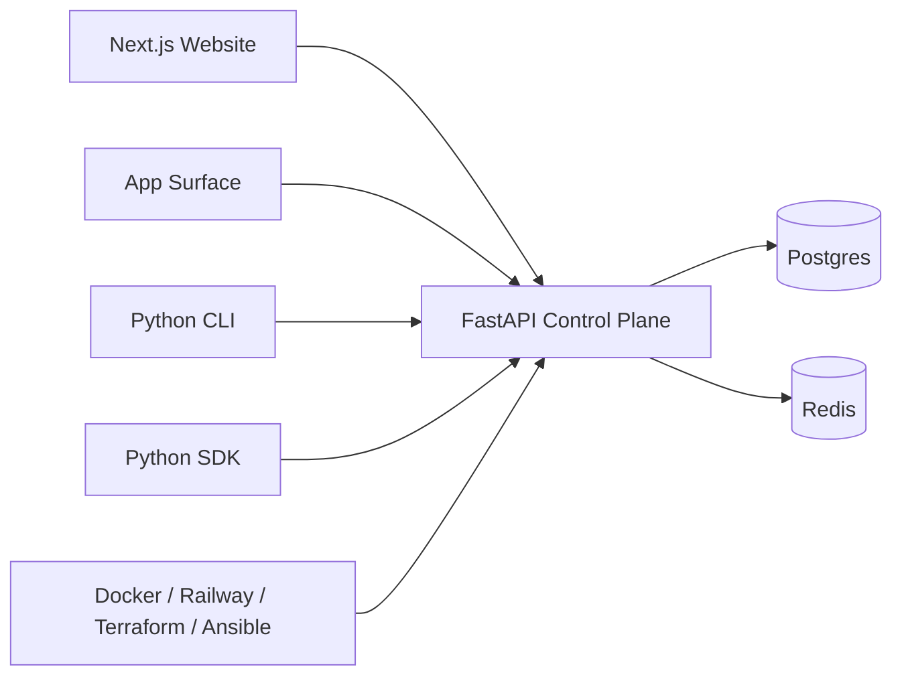
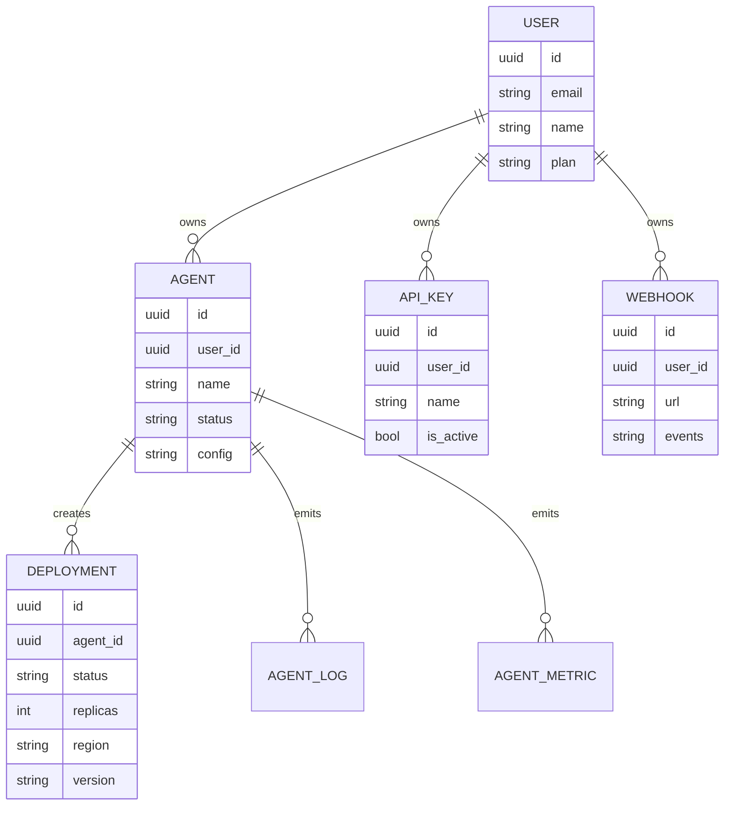

# MUTX Technical Whitepaper

> Historical sections remain intact for context. For current route and surface truth, read [Addendum (2026-03-22)](#addendum-2026-03-22-code-truth-corrections) alongside the main body.

## Abstract

MUTX is a source-available control plane for AI agents.

Its premise is simple: most teams can already prototype an agent, but very few teams can operate one like production software. The failure mode is not lack of reasoning capability. The failure mode is lack of control-plane rigor: identity, ownership, deployment semantics, keys, webhooks, observability, reproducibility, and honest contracts between every surface that touches the system.

This paper explains what MUTX is today, what problem it is solving, how the current implementation is structured, and which parts of the architecture are present versus still being hardened.

This document deliberately separates **current implementation** from **target architecture**.

---

## 1. Executive Summary

MUTX is being built as the operational layer around agent systems.

Today, the repository already includes:

- a Next.js website and app surface
- a FastAPI control plane
- a Python CLI
- a Python SDK
- route groups for auth, agents, deployments, API keys, webhooks, health, and readiness
- infrastructure code spanning Docker, Railway, Terraform, Ansible, and monitoring foundations
- a live waitlist path wired through the product surface

The current system already models the outer shell of an agent platform well: users, agents, deployments, keys, webhooks, health, and operator-facing entry points. The core thesis is that this shell is the product wedge.

The long-term goal is not to be another wrapper around model calls. The long-term goal is to become the control plane teams use to deploy, run, observe, and govern agent systems.

---

## 2. The Problem: Agent Systems Break Outside The Demo

Agent software often succeeds in isolated development environments and then fails during the first serious attempt at operation.

The recurring failure modes are not exotic:

| Failure mode | What breaks | Why it matters |
| --- | --- | --- |
| Identity drift | unclear ownership of agents and deployments | operators cannot safely manage shared environments |
| Deployment ambiguity | "run this agent" has no durable system record | lifecycle, restart, rollback, and metrics become informal |
| Secret sprawl | API keys and tokens live in ad hoc env vars and notebooks | security posture degrades immediately |
| Weak observability | logs exist, but not as part of an operator workflow | debugging becomes expensive and reactive |
| Surface drift | website, API, CLI, SDK, and docs disagree | trust in the platform erodes |
| Runtime mismatch | local assumptions do not survive hosted infrastructure | teams lose confidence before they reach production |

The result is predictable: many teams have an agent demo, but very few have an agent system.

MUTX exists to close that gap.

---

## 3. Design Goals

MUTX is built around a few explicit goals.

### 3.1 Control plane first
The first job is to model the system around the agent, not just the agent itself.

### 3.2 Honest contracts
The API, CLI, SDK, docs, and web surfaces should describe the same product.

### 3.3 Stateful records
Agents, deployments, keys, and hooks should exist as durable resources with lifecycle semantics.

### 3.4 Operator usability
The product should support the people running the system, not only the people coding against it.

### 3.5 Open interfaces
The platform should stay interoperable, inspectable, and contributor-friendly.

### 3.6 Incremental hardening
The system should improve by tightening contracts and guarantees, not by adding disconnected surface area.

---

## 4. Non-Goals

MUTX is not currently trying to be:

- a model provider
- a closed-source agent framework
- a prompt IDE
- a token resale business
- a fake-finished enterprise platform

It is much more useful to treat MUTX as an open, evolving control-plane product than to describe it as a completed runtime stack.

---

## 5. System Overview

At a high level, MUTX has four major layers:

1. **Operator surface**: the website and app experience built in Next.js
2. **Control plane**: the FastAPI backend and persistent data model
3. **Programmatic interfaces**: the Python CLI and SDK
4. **Infrastructure automation**: Docker, Railway, Terraform, Ansible, and monitoring assets

### 5.1 Current implementation surface

| Surface | Current role |
| --- | --- |
| `app/` | landing site, app host, route proxies, waitlist, metadata |
| `src/api/` | auth, agents, deployments, API keys, webhooks, newsletter, health |
| `cli/` | terminal access for status, auth, and resource workflows |
| `sdk/mutx/` | Python client wrappers around control-plane APIs |
| `infrastructure/` | Terraform, Ansible, monitoring, and deployment references |

---

## 6. Control Plane Architecture

The control plane is implemented as a FastAPI application with route groups mounted under the `/v1/*` namespace.

> Note (2026-03-22): This section describes the original routing layout. In the current implementation, all control-plane routes are mounted under `/v1/*`. For the up-to-date route structure, see [§17.1 Backend route prefix correction](#171-backend-route-prefix-correction) in the addendum.

### 6.1 Route groups

The live route families in the current codebase are organized as:

- `/v1/auth`
- `/v1/agents`
- `/v1/deployments`
- `/v1/api-keys`
- `/v1/webhooks`
- `/v1/newsletter`
- `/v1/health`
- `/v1/ready`

Additional `/v1/*` surfaces (for example `/v1/templates`, `/v1/assistant`, `/v1/sessions`, `/v1/runs`, `/v1/monitoring`, `/v1/budgets`, `/v1/rag`, and `/v1/runtime`) are described in detail in [Section 17.1](#171-backend-route-prefix-correction).

### 6.2 Resource model

MUTX already models several important control-plane resources in the database layer.

This matters because it gives MUTX a durable substrate for operator workflows. Instead of saying "an agent is running somewhere," the system can say which user owns it, which deployments exist for it, which metrics and logs attach to it, and which API keys and hooks surround it.

---

## 7. Auth, Ownership, And Governance

MUTX already exposes a meaningful auth surface: registration and login, access and refresh tokens, logout and current-user inspection, email verification and password reset flows.

### 7.1 API keys

API keys are first-class resources. The platform generates prefixed keys (`mutx_live_...`), stores only hashed values server-side, supports create, list, revoke, and rotate workflows, and exposes the one-time plaintext value only at creation time.

### 7.2 Governance

Governance is integrated via [Faramesh](https://faramesh.dev) and provides deterministic policy enforcement, approval workflows, and credential brokering for MUTX-managed agents. See `docs/governance.md` for full coverage.

---

## 8. Agent And Deployment Lifecycle

An **agent** is the logical unit of behavior. A **deployment** is an operational instance or rollout of that agent.

Agent status values include: `creating`, `running`, `stopped`, `failed`, `deleting`. Deployments carry fields for status, replicas, region, version, node_id, started_at, ended_at, and error_message.

Today this lifecycle is strongest as a control-plane record model. The deeper execution substrate behind those records is still being hardened toward full platform architecture.

---

## 9. Infrastructure Story

MUTX includes both **current hosted deployment machinery** and **target infrastructure direction**.

### 11.1 Current implementation

The current project is structured around Railway for hosted application services, Docker and Docker Compose for local orchestration, Terraform and Ansible as infrastructure foundations, and Prometheus and Grafana config for monitoring setup.

### 11.2 Target architecture direction

The repo and docs point toward a more isolated deployment story: dedicated tenant environments, stronger network boundaries, and tighter coupling between deployment records and real execution infrastructure.

---

## 10. Why The Repo Structure Matters

One of the strongest things about MUTX is the shape of the repository itself.

It already captures the important truth about agent products: the website matters, the app host matters, the API matters, the CLI matters, the SDK matters, the infrastructure code matters, and the docs matter.

A serious agent platform is not one repo folder with a wrapper class. It is a system with several coordinated operator surfaces. MUTX already reflects that reality.

---

## 11. Current Status And Roadmap

The repo is strongest where many early projects are weakest: product boundaries, resource modeling, and interface breadth.

The next high-leverage work is well defined:

- tighten auth and ownership enforcement
- align CLI and SDK behavior to the live contract
- make the app host a fully data-backed dashboard
- improve route coverage and CI confidence
- replace weak implicit behavior with stronger typed schemas and lifecycle semantics

This is not a vague roadmap. It is a direct continuation of the architecture already present.

---

## 12. Why MUTX Can Matter

Most agent companies are still arguing about prompts and frameworks. MUTX is more interesting because it is arguing about systems.

If agent software becomes real infrastructure, then the valuable layer is the one that makes it deployable, operable, observable, and governable.

That is the layer MUTX is building.

Not a chatbot shell. Not a prompt wrapper. A control plane.

---

## Addendum (2026-03-22): Code-Truth Corrections

This addendum captures architecture facts that became clearer after the main body above was written.

### 17.1 Backend route prefix correction

The live FastAPI public control-plane contract is mounted under **`/v1/*`**.

The current public backend shape includes: root probes at `/`, `/health`, `/ready`, and `/metrics`; public control-plane routes such as `/v1/auth`, `/v1/agents`, `/v1/deployments`, `/v1/templates`, `/v1/assistant`, `/v1/sessions`, `/v1/runs`, `/v1/api-keys`, `/v1/webhooks`, `/v1/monitoring`, `/v1/budgets`, `/v1/rag`, `/v1/runtime`, and related families.

Prefer the mounted code in `src/api/main.py` and the generated OpenAPI snapshot in `docs/api/openapi.json` over earlier prose examples.

### 17.2 App-surface correction

The app surface splits into:

- **`/dashboard`**: the canonical operator-facing shell, backed by live same-origin Next.js handlers under `app/api/dashboard/*`
- **`/control/*`**: the browser demo/control-plane showcase rendered from `app/control/[[...slug]]/page.tsx`

### 17.3 Placeholder-backed subsystem correction

- RAG search is mounted publicly, but returns placeholder results until vector-backed storage is wired in
- the scheduler route exists in code but is currently unmounted from the public router set
- Vault integration exists as an infrastructure stub, not a live secret-management implementation

### 17.4 Documentation truth rule

The most reliable order of truth for MUTX documentation is now:

1. mounted code in `src/api/`, `app/api/`, `app/dashboard/`, `app/control/`, `cli/`, and `sdk/mutx/`
2. the generated OpenAPI snapshot in `docs/api/openapi.json`
3. prose documentation in `README.md`, `docs/`, `roadmap.md`, and this white paper

The published GitBook site should remain a presentation layer over repo truth, not a parallel source of documentation.
