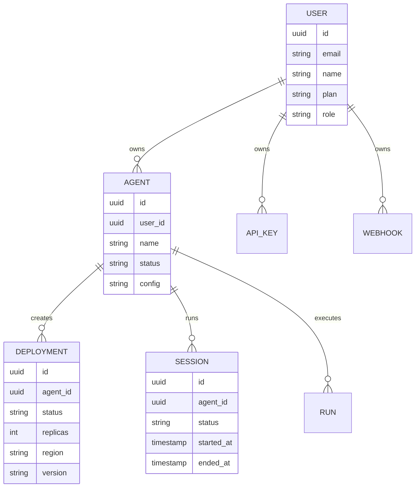

# MUTX Technical Whitepaper

> Last updated: April 2026. Reflects v1.4 release (RBAC, OIDC, Kubernetes/Helm, Faramesh governance engine, autonomous dev shop).

## Abstract

MUTX is a source-available control plane for deploying, operating, and governing AI agents.

Most teams can prototype an agent. Very few can run one in production with durable identity, deployment semantics, sessions, health, access control, governance, and honest operator contracts. The failure mode is not lack of reasoning capability — it is lack of control-plane rigor.

This paper explains what MUTX is, what problem it solves, how the implementation is structured, where the market sits, and how the product and business are positioned to capture it.

---

## 1. The Problem

Agent software succeeds in development and fails in production. The pattern is consistent:

| Failure mode | What breaks | Why it matters |
| --- | --- | --- |
| Identity drift | No clear ownership of agents and deployments | Cannot safely manage shared environments |
| Deployment ambiguity | "Run this agent" has no durable system record | Lifecycle, restart, rollback become informal |
| Secret sprawl | API keys and tokens in ad hoc env vars | Security posture degrades immediately |
| Weak observability | Logs exist but not as part of an operator workflow | Debugging is expensive and reactive |
| No governance | Agents act without policy boundaries | Compliance failures, budget overruns, trust erosion |
| Surface drift | Website, API, CLI, SDK, docs disagree | Platform trust erodes |

The result: many teams have an agent demo. Very few have an agent system.

Gartner projects that 40% of enterprise AI agent projects will be cancelled by 2027 due to escalating costs and governance failures. The market is moving from "cool demo" to "show me the operating model." The EU AI Act main obligations land August 2, 2026 — governance stops being optional.

MUTX exists to close the gap between demo and system.

---

## 2. Design Principles

**Control plane first.** Model the system around the agent, not just the agent itself.

**Honest contracts.** The API, CLI, SDK, docs, and web surfaces describe the same product. When they disagree, the code is canonical.

**Governance by default.** Every agent action is loggable, policied, and auditable. Not bolted on — built in.

**Operator usability.** Support the people running the system, not only the people coding against it.

**Open interfaces.** Stay interoperable, inspectable, and contributor-friendly. Source-available under BUSL-1.1 with Apache-2.0 conversion.

**Incremental hardening.** Improve by tightening guarantees, not by adding disconnected surface area.

---

## 3. System Architecture

```
┌──────────────────────────────────────────────────────────┐
│                       SURFACES                           │
│   Landing Site  │  Dashboard  │  CLI + TUI  │  SDK       │
├──────────────────────────────────────────────────────────┤
│                    GOVERNANCE LAYER                       │
│   Faramesh (FPL)  │  RBAC + OIDC  │  Audit Trail         │
├──────────────────────────────────────────────────────────┤
│                   CONTROL PLANE API                       │
│   FastAPI /v1/*  │  Postgres  │  Redis  │  OpenTelemetry  │
├──────────────────────────────────────────────────────────┤
│                   RUNTIME LAYER                           │
│   OpenClaw  │  Ollama  │  LangChain  │  Custom            │
├──────────────────────────────────────────────────────────┤
│                   INFRASTRUCTURE                          │
│   Docker Compose  │  Railway  │  Terraform  │  Helm/K8s   │
└──────────────────────────────────────────────────────────┘
```

### 3.1 Operator surfaces

| Surface | Path / URL | Role |
| --- | --- | --- |
| Public site | `mutx.dev` | Product narrative, quickstart, install paths |
| Release summary | `mutx.dev/releases` | Current release, assets, checksums, release notes |
| Desktop app | `mutx.dev/download/macos` | Signed & notarized macOS operator app |
| Dashboard | `app.mutx.dev/dashboard` | Authenticated operator shell |
| Control demo | `app.mutx.dev/control/*` | Browser demo of the control-plane surface |
| Browser proxies | `app/api/` | Same-origin route handlers for all dashboard workflows |
| CLI + TUI | `cli/` | `mutx` CLI and `mutx tui` Textual operator shell |
| SDK | `sdk/mutx/` | Python client access to the full control plane |
| Docs | `docs.mutx.dev` | Canonical setup, architecture, API, troubleshooting |

### 3.2 Control plane API

The FastAPI backend mounts all public control-plane routes under `/v1/*`, with root probes at `/`, `/health`, `/ready`, and `/metrics`.

Current route families:

`auth` · `assistant` · `agents` · `deployments` · `templates` · `sessions` · `runs` · `usage` · `api-keys` · `webhooks` · `monitoring` · `budgets` · `rag` · `clawhub` · `runtime` · `analytics` · `onboarding` · `swarms` · `leads`

OpenAPI snapshot: [`docs/api/openapi.json`](docs/api/openapi.json)

### 3.3 Resource model



---

## 4. Governance Engine

MUTX integrates [Faramesh](https://faramesh.dev) as its governance engine — the single clearest technical differentiator in the product.

Faramesh provides deterministic AI agent governance through the [FPL (Faramesh Policy Language)](https://github.com/faramesh/fpl-lang):

- **Policy enforcement** — Permit, deny, or defer tool calls based on rules
- **Session budgets** — Max spend, daily limits, call counts per session
- **Phase workflows** — Scope tool visibility by workflow stage (intake → execution)
- **Credential brokering** — Strip API keys, inject ephemeral credentials per call
- **Ambient guards** — Rate limiting across sessions, not just per call

### 4.1 Authority levels (R0–R3)

| Level | Scope | Human role |
| --- | --- | --- |
| R0 | Read-only: classify, search, summarize | Validates process |
| R1 | Draft preparation: suggestions, form completion | Approves final send |
| R2 | Workflow state: reminders, task creation, alerts | Reviews non-economic decisions |
| R3 | Low-risk pre-approved operational actions | Confirms orders, payments, critical comms |

### 4.2 Five governance commitments

1. Everything logged and inspectable
2. Differentiated permissions by role
3. Manual fallback always available
4. No promise of full autonomy on critical tasks
5. No definitive send, order, or payment without human confirmation

### 4.3 Roadmap: live policy service

Priority 0: Real-time guardrails middleware (block/warn/steer/require_approval) with live policy hot-reload, versioned API, and rollback.

---

## 5. Authentication and Access Control

MUTX enforces role-based access control (RBAC) and supports OIDC token validation:

- **RBAC** — `require_role()` gates on approvals (DEVELOPER/ADMIN), security (ADMIN), policies (ADMIN), and audit (ADMIN/AUDIT_ADMIN) routes
- **OIDC Token Validation** — JWKS fetcher with TTL cache, JWT signature validation, iss/aud/exp claim checks; compatible with Okta, Auth0, Azure AD, and Keycloak
- Configured via `OIDC_ISSUER`, `OIDC_CLIENT_ID`, `OIDC_JWKS_URI` environment variables
- API keys are first-class resources: prefixed (`mutx_live_...`), hashed server-side, one-time plaintext exposure

---

## 6. Observability

MUTX uses OpenTelemetry as its canonical telemetry model.

**Span naming**: All spans follow `mutx.<operation>` (e.g. `mutx.agent.execute`, `mutx.tool.execution`, `mutx.session.start`).

**Standard attributes**: `agent.id`, `session.id`, `trace.id` propagated across services.

**SDK usage** (`sdk/mutx/telemetry.py`):
```python
from mutx.telemetry import init_telemetry, span, trace_context

init_telemetry("my-agent", endpoint="http://collector:4317")

with span("mutx.agent.execute", {"agent.id": agent_id}) as sp:
    sp.set_attribute("session.id", session_id)
```

**Middleware** (`src/api/middleware/tracing.py`): Extracts `TRACEPARENT`/`TRACESTATE`, injects `trace_id` and `span_id` into `request.state`, enables distributed trace propagation.

---

## 7. Infrastructure

### 7.1 Deployment modes

| Mode | Use case |
| --- | --- |
| `make dev-up` | Local development (Docker Compose) |
| Railway | Hosted application services |
| Terraform + Ansible | Cloud provisioning (DigitalOcean) |
| Helm chart | Kubernetes deployment (`infrastructure/helm/mutx/`) |

### 7.2 Kubernetes / Helm

Production-grade Helm chart at `infrastructure/helm/mutx/`:

- `values.yaml` (dev), `values.prod.yaml` (HA), `values.staging.yaml` overlays
- Component templates: API, Web, OTel Collector, Redis, Postgres, Ingress, HPA
- Auto-generated secrets, configurable replicas, resource limits

### 7.3 Cost model

| Deployment mode | COGS per customer/month |
| --- | --- |
| Shared multi-tenant | €12.37 (recommended default) |
| Shared K8s | €16.17 |
| Single-tenant VPC | €215.97 (enterprise add-on) |

BYOK model keys: customers carry their own inference costs. MUTX carries control-plane infra.

---

## 8. Competitive Landscape

No one has the whole stack. Fragmentation is the opportunity.

| | Guardrails | Observability | Multi-Agent | Policy | Audit | SDK/FW | Deploy | Governance |
| --- | --- | --- | --- | --- | --- | --- | --- | --- |
| **MUTX** | roadmap | OTel | roadmap | Faramesh | roadmap | Python | Helm/K8s | FPL |
| Agent Control | yes | — | — | yes | — | Python | — | — |
| humanlayer/ACP | — | — | yes | — | — | — | K8s | — |
| NVIDIA NeMoClaw | yes | — | — | — | — | — | yes | — |
| Fiddler | yes | yes | — | yes | yes | — | yes | yes |
| Komodor | — | yes | yes | — | — | — | yes | — |

**Agent Control (Galileo)** — Closest OSS competitor. Apache 2.0. Already where MUTX talks about being. Weaknesses: no SSO/RBAC, no OTel, no durable outer-loop, no compliance. Best OSS governance wedge.

**Fiddler** — Strongest enterprise control-plane. $100M raised. Sub-100ms guardrails. Enterprise-only, $100K+/year. 6-12 month sales cycle. Don't fight head-on; be the lighter, open alternative.

**NVIDIA NeMoClaw** — Owns the secure runtime. MUTX owns fleet governance, evidence, approvals, and multi-runtime control. They stack, they don't compete.

**humanlayer/ACP** — Sees the future clearly (long-lived agents, durable queues) but product isn't there yet.

**Adjacent threats**: LangSmith/LangGraph building a stealth control plane inside LangChain. Portkey moving from "AI gateway" to "AI gateway + control plane." Both are warning signs.

---

## 9. Product Strategy

### 9.1 PicoMUTX — The Commercial Wedge

PicoMUTX is the commercially sellable face of MUTX. Not a separate product — the vendible entry point of the same system.

> The motor is MUTX. The sellable message is PicoMUTX. The first strengthens thanks to the second.

Three product lines:

1. **PicoMUTX/Agent Autopilot** — Mass market shelf product (€49-149/mo)
2. **PicoMUTX Advisory** — High-touch service ($1k-10k)
3. **MUTX Full Control Plane** — Enterprise ($18k-50k+)

### 9.2 Dual GTM

| | PicoMUTX | MUTX |
| --- | --- | --- |
| Channel | IG/FB/TT/YT + website | LinkedIn + X + mutx.dev |
| Buyer | Founders, devs, ops | CTOs, platform leads, VCs |
| Motion | No-touch SaaS / social / ads | High-touch / demo / pilot |
| Price entry | €49/mo | $18,000+ |
| Goal | Day 1 cash + customers | Enterprise pipeline + credibility |

### 9.3 Value ladder (7 tiers)

| Step | Product | Price |
| --- | --- | --- |
| 1 | Agent Autopilot Starter SaaS | €49/mo |
| 2 | Agent Autopilot Pro SaaS | €149/mo |
| 3 | Done-For-You Onboarding | $1,000 |
| 4 | MUTX Founding Charter | $500 one-time (50 slots) |
| 5 | MUTX Founding Partner | $2,000 one-time (20 slots) |
| 6 | PicoMUTX Advisory Sprint | $10,000 |
| 7 | MUTX Full Control Plane | $18k-50k+ |

### 9.4 Italy entry (Perugia GTM)

First market: Perugia SMEs — manufacturing, distribution, engineering firms.

1. **Fit call** (free, 15-20 min qualify)
2. **Diagnosi Operativa** (€900-2,000, 5-10 days)
3. **Pilot 30/45 giorni** (€3,000-7,500, 1 process, 1 owner, 1 KPI)
4. **Layer Operativo Gestito** (€600-2,500/mo recurring)
5. **Build/Integration** (€5,000-12,000)
6. **Upgrade to MUTX Full Control Plane** (€18,000-50,000+)

Priority wedges: Quotes & Follow-up (#1), Procurement & Supplier Reminders, Document Backoffice.

### 9.5 Global sequence

- **0-30 days**: Close first pilot. Publish first English content. Zero US revenue pressure.
- **30-90 days**: Activate US dev/operator audience. 3-5 design partner conversations.
- **90-180 days**: European GTM with dual proof. Target VC-backed scaleups under EU AI Act pressure.
- **180+ days**: Brazil expansion. With proof from three markets, fintech and ICT services open up.

---

## 10. Financial Model

### 10.1 PicoMUTX wedge (18-month base case)

| Metric | Value |
| --- | --- |
| Starting capital | €0 (bootstrap) |
| Total diagnostics sold | 51 |
| Total pilots started | 20 |
| Recurring clients at M18 | 6.7 |
| Total revenue | ~€241,600 |
| Total variable costs | ~€8,200 |
| Total fixed costs | ~€95,400 |
| Cumulative net profit | ~€138,000 |
| Gross margin | ~96.6% |
| Net margin at M18 | ~77.3% |
| Cash positive | Month 7 |
| Founder comp affordable | Month 11 |
| MRR at M18 | ~€8,000 |
| Implied ARR at M18 | ~€96,000 |

### 10.2 Platform build cost

Minimal P0 build (OTel spine, audit, auth, guardrails, one adapter): 2 senior engineers for 3-6 months = €50k-150k.

The wedge does not comfortably self-fund the platform on competitive timelines. Bridge options: outside capital, customer crowdfunding, or founder-paced AI-leveraged building.

### 10.3 Customer ROI (sample)

Quotes & Follow-up for 2 people spending 10 hrs/week each:

- Annual friction: €103,200
- Expected improvement: ~€39,600/year
- ROI vs Y1 cost: 138%
- Payback: ~5 months
- Value multiple: 2.4x

### 10.4 Capitalization strategy (3 pillars)

**Pillar 1 — Shelf product + Advisory**: DFY onboarding = fastest cash. Advisory sprint = case study machine. One $10k advisory client = 200+ months of Starter SaaS fees.

**Pillar 2 — Pre-launch founding program**: Founding Charter ($500, 50 slots), Founding Partner ($2,000, 20 slots), Founding Studio ($5,000, 5 slots). Fixed slot count, hard deadline when MUTX ships publicly.

**Pillar 3 — Customer crowdfunding**: Version A (now): product pre-orders, no equity. Version B (6-12 months): equity crowdfunding via Republic/Seedrs. Requires clean cap table, legal entity, regulatory compliance.

---

## 11. Build Roadmap

### Priority 0 (90-day critical path)

1. OpenTelemetry-native observability (event spine, not vanity dashboard)
2. Append-only audit store + trace capture
3. Enterprise SSO + RBAC (OIDC: Okta, Auth0, Keycloak, Google)
4. Real-time guardrails middleware (block/warn/steer/require_approval)
5. LangChain adapter (one excellent adapter before five mediocre ones)

### Priority 1

- Live policy service with hot reload (versioned API + rollback)
- Human-in-the-loop approval workflows (Slack/email routing)
- Ollama/local model adapter
- MCP tool exposure, thin A2A handoff

### Priority 2

- Compliance evidence exports (SOC2, HIPAA, GDPR templates)
- Privacy router / data residency
- CrewAI, AutoGen, Google ADK adapters
- Kubernetes operator

---

## 12. What Ships Today

### Control plane (v1.4)

- Public route families under `/v1/*` covering auth, assistant, agents, deployments, templates, sessions, runs, usage, api-keys, webhooks, monitoring, budgets, rag, clawhub, runtime, analytics, onboarding, swarms, leads
- Root health probes at `/`, `/health`, `/ready`, `/metrics`
- RBAC enforcement on all routes
- OIDC token validation with JWKS caching
- OpenTelemetry distributed tracing
- Kubernetes Helm chart for production deployment

### Governance

- Faramesh integration (FPL policy language, session budgets, credential brokering, ambient guards)
- R0-R3 authority levels
- Five governance commitments

### Operator surfaces

- Authenticated dashboard (`app/dashboard/`)
- Browser demo (`app/control/`)
- Browser proxy handlers (`app/api/`)
- `mutx` CLI + `mutx tui` Textual shell
- Python SDK (`pip install mutx`)
- Signed macOS desktop app

### Infrastructure

- Docker Compose local dev
- Terraform + Ansible for cloud
- Helm chart for Kubernetes (API, Web, OTel, Redis, Postgres, Ingress, HPA)
- Prometheus + Grafana monitoring configs

---

## 13. Strategic Tensions

Honest about the open questions:

1. **Wedge vs Platform**: Are we a services-led wedge that becomes a platform, or a platform disguised as services? Until answered, messaging, hiring, roadmap, and capital allocation fight each other.

2. **Self-serve vs Enterprise**: PicoMUTX SaaS is a different business model than MUTX enterprise. The Final Memo flags cheap self-serve PLG as "not a packaging tweak — that is a third business model."

3. **Founder bottleneck**: Operating model shows founder exceeding 100% utilization by Month 13. Hard scaling constraint.

4. **Compliance window**: SOC2 Type II costs $50-100K and takes 12+ months. EU AI Act obligations land August 2026. The window is narrow.

---

## 14. Documentation Truth Rule

The most reliable order of truth for MUTX documentation:

1. Mounted code in `src/api/`, `app/api/`, `app/dashboard/`, `app/control/`, `cli/`, `sdk/mutx/`
2. The generated OpenAPI snapshot in `docs/api/openapi.json`
3. Prose documentation in `README.md`, `docs/`, `roadmap.md`, and this whitepaper

The published GitBook site is a presentation layer over repo truth, not a parallel source.

---

## 15. Built On

- **[agent-run](https://github.com/builderz-labs/agent-run)** — Agent observability standard. MUTX Observability Schema is based on agent-run with renamed types (MutxRun, MutxStep, MutxCost).
- **[AARM](https://github.com/aarm-dev/docs)** — Autonomous Action Runtime Management specification. MUTX implements AARM components (Action Mediation, Policy Engine, Approval Service, Telemetry Exporter).
- **[Faramesh](https://github.com/faramesh/faramesh-core)** — Pre-execution governance engine. MUTX uses Faramesh as the AARM-compliant policy enforcement backend.
- **[Mission Control](https://github.com/builderz-labs/mission-control)** — Dashboard inspiration and agent fleet management concepts.

---

## 16. Conclusion

MUTX should be understood as a governed control plane for agent systems.

Its contribution is not the claim that every piece is finished. Its contribution is that it already models the right surfaces — identity, deployment, governance, observability, access control, and honest operator contracts — while the market is still arguing about prompts.

If agent software becomes real infrastructure, the valuable layer is the one that makes it deployable, operable, observable, and governable.

That is the layer MUTX is building.

**Deploy agents like services. Operate them like systems. Govern them like infrastructure.**
