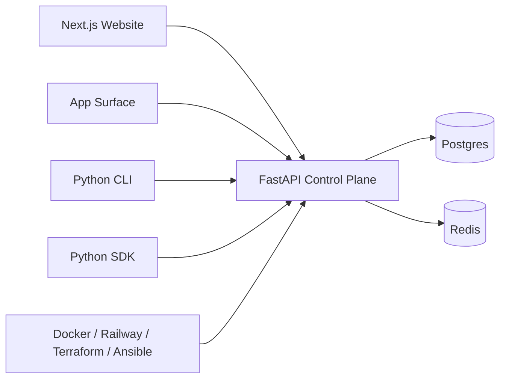
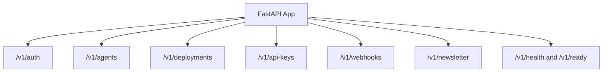
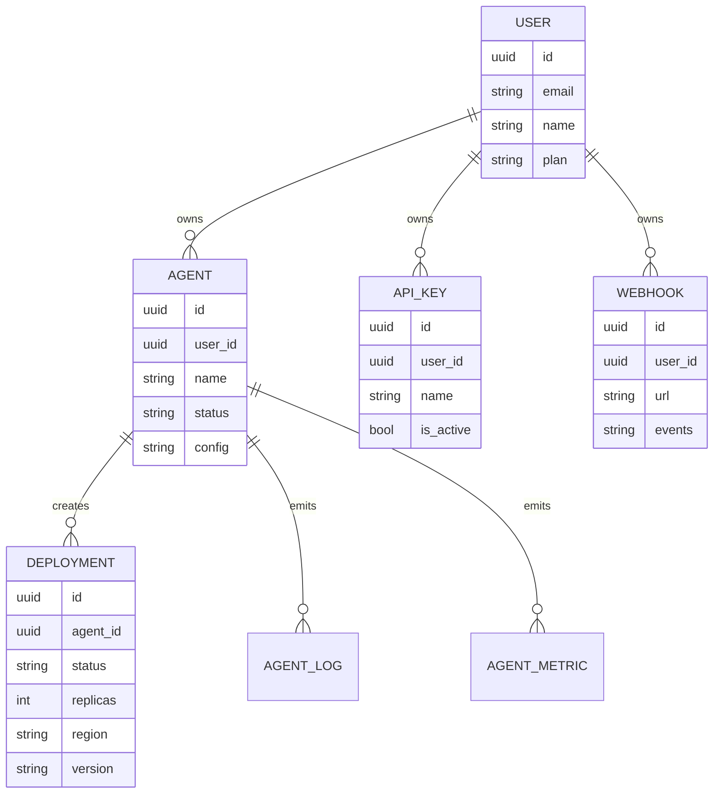
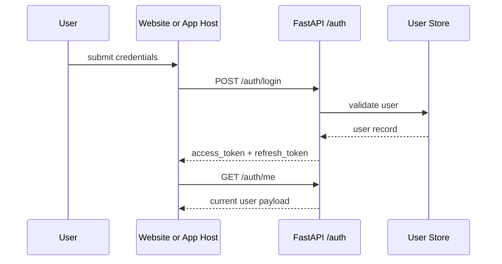
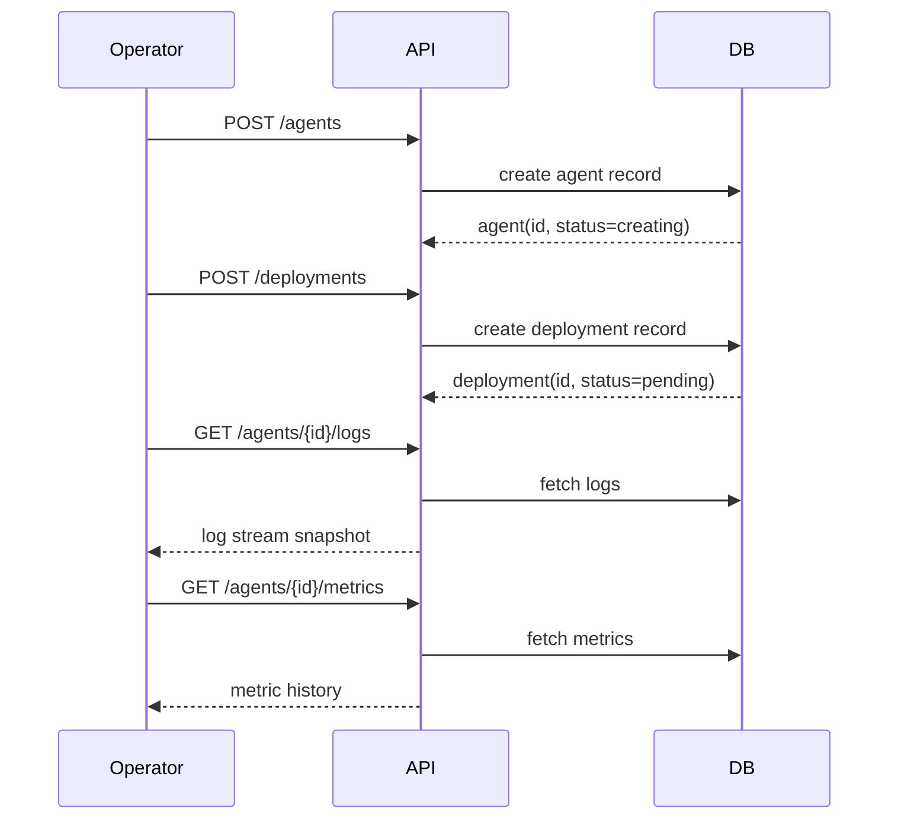
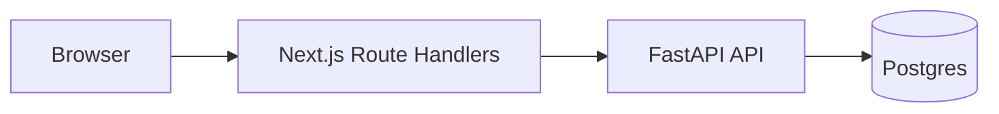

# MUTX Technical Whitepaper

> Historical sections remain intact for context. For current route and surface truth, read [Addendum (2026-03-22)](#17-addendum-2026-03-22-code-truth-corrections) alongside the main body.

## Abstract

MUTX is a source-available control plane for AI agents.

Its premise is simple: most teams can already prototype an agent, but very few teams can operate one like production software. The failure mode is not lack of reasoning capability. The failure mode is lack of control-plane rigor: identity, ownership, deployment semantics, keys, webhooks, observability, reproducibility, and honest contracts between every surface that touches the system.

This paper explains what MUTX is today, what problem it is solving, how the current implementation is structured, and which parts of the architecture are present versus still being hardened.

This document deliberately separates **current implementation** from **target architecture**.

---

## 1. Executive Summary

MUTX is being built as the operational layer around agent systems.

Today, the repository already includes:

- a Next.js website and app surface
- a FastAPI control plane
- a Python CLI
- a Python SDK
- route groups for auth, agents, deployments, API keys, webhooks, health, and readiness
- infrastructure code spanning Docker, Railway, Terraform, Ansible, and monitoring foundations
- a live waitlist path wired through the product surface

The current system already models the outer shell of an agent platform well: users, agents, deployments, keys, webhooks, health, and operator-facing entry points. The core thesis is that this shell is the product wedge.

The long-term goal is not to be another wrapper around model calls. The long-term goal is to become the control plane teams use to deploy, run, observe, and govern agent systems.

---

## 2. The Problem: Agent Systems Break Outside The Demo

Agent software often succeeds in isolated development environments and then fails during the first serious attempt at operation.

The recurring failure modes are not exotic:

| Failure mode | What breaks | Why it matters |
| --- | --- | --- |
| Identity drift | unclear ownership of agents and deployments | operators cannot safely manage shared environments |
| Deployment ambiguity | "run this agent" has no durable system record | lifecycle, restart, rollback, and metrics become informal |
| Secret sprawl | API keys and tokens live in ad hoc env vars and notebooks | security posture degrades immediately |
| Weak observability | logs exist, but not as part of an operator workflow | debugging becomes expensive and reactive |
| Surface drift | website, API, CLI, SDK, and docs disagree | trust in the platform erodes |
| Runtime mismatch | local assumptions do not survive hosted infrastructure | teams lose confidence before they reach production |

The result is predictable: many teams have an agent demo, but very few have an agent system.

MUTX exists to close that gap.

---

## 3. Design Goals

MUTX is built around a few explicit goals.

### 3.1 Control plane first
The first job is to model the system around the agent, not just the agent itself.

### 3.2 Honest contracts
The API, CLI, SDK, docs, and web surfaces should describe the same product.

### 3.3 Stateful records
Agents, deployments, keys, and hooks should exist as durable resources with lifecycle semantics.

### 3.4 Operator usability
The product should support the people running the system, not only the people coding against it.

### 3.5 Open interfaces
The platform should stay interoperable, inspectable, and contributor-friendly.

### 3.6 Incremental hardening
The system should improve by tightening contracts and guarantees, not by adding disconnected surface area.

---

## 4. Non-Goals

MUTX is not currently trying to be:

- a model provider
- a closed-source agent framework
- a prompt IDE
- a token resale business
- a fake-finished enterprise platform

It is much more useful to treat MUTX as an open, evolving control-plane product than to describe it as a completed runtime stack.

---

## 5. System Overview

At a high level, MUTX has four major layers:

1. **Operator surface**: the website and app experience built in Next.js
2. **Control plane**: the FastAPI backend and persistent data model
3. **Programmatic interfaces**: the Python CLI and SDK
4. **Infrastructure automation**: Docker, Railway, Terraform, Ansible, and monitoring assets

### 5.1 Current implementation surface

| Surface | Current role |
| --- | --- |
| `app/` | landing site, app host, route proxies, waitlist, metadata |
| `src/api/` | auth, agents, deployments, API keys, webhooks, newsletter, health |
| `cli/` | terminal access for status, auth, and resource workflows |
| `sdk/mutx/` | Python client wrappers around control-plane APIs |
| `infrastructure/` | Terraform, Ansible, monitoring, and deployment references |

---

## 6. Control Plane Architecture

The control plane is implemented as a FastAPI application with route groups mounted directly at top-level prefixes rather than behind a global `/v1` namespace.

> Note (2026-03-22): This section describes the original routing layout. In the current implementation, all control-plane routes are mounted under `/v1/*`. For the up-to-date route structure, see [§17.1 Backend route prefix correction](#171-backend-route-prefix-correction) in the addendum.

### 6.1 Route groups

Historically, the live route families in the codebase were organized as:

- `/v1/auth`
- `/v1/agents`
- `/v1/deployments`
- `/v1/api-keys`
- `/v1/webhooks`
- `/v1/newsletter`
- `/v1/health`
- `/v1/ready`

Additional `/v1/*` surfaces (for example `/v1/templates`, `/v1/sessions`, `/v1/runs`, `/v1/budgets`) are documented in the OpenAPI specification at [`docs/api/openapi.json`](./docs/api/openapi.json).

### 6.2 Resource model

MUTX already models several important control-plane resources in the database layer.

This matters because it gives MUTX a durable substrate for operator workflows. Instead of saying "an agent is running somewhere," the system can say:

- which user owns it
- which deployments exist for it
- which metrics and logs attach to it
- which API keys and hooks exist around it

---

## 7. Auth, Ownership, And Governance

MUTX already exposes a meaningful auth surface:

- registration and login
- access and refresh tokens
- logout and current-user inspection
- email verification and password reset flows

### 7.1 Auth flow

### 7.2 API keys

API keys are first-class resources. The platform:

- generates prefixed keys (`mutx_live_...`)
- stores only hashed values server-side
- supports create, list, revoke, and rotate workflows
- exposes the one-time plaintext value only at creation time

This is the kind of control-plane behavior agent platforms usually delay until too late.

### 7.3 Governance status

The repo is honest about a key gap: ownership hardening is still an active area of work. The model and route surfaces are present, but the roadmap still prioritizes tightening auth and per-user access checks across all relevant resources.

That honesty is a strength. It makes the next layer of work legible.

---

## 8. Agent And Deployment Lifecycle

MUTX treats agents and deployments as related but separate records.

An **agent** is the logical unit of behavior.
A **deployment** is an operational instance or rollout of that agent.

### 8.1 Agent lifecycle today

The codebase currently models agent status values such as:

- `creating`
- `running`
- `stopped`
- `failed`
- `deleting`

Deployments are stored with operational fields such as:

- `status`
- `replicas`
- `region`
- `version`
- `node_id`
- `started_at`
- `ended_at`
- `error_message`

### 8.2 Lifecycle flow

### 8.3 Current implementation note

Today, this lifecycle is strongest as a control-plane record model. The deeper execution substrate behind those records is still being hardened. That means the semantics already exist, while the runtime behavior is still evolving toward the target platform architecture.

---

## 9. Website, App Host, And Same-Origin Operator UX

MUTX is unusual in that the web layer is part of the product thesis rather than a detached marketing shell.

### 9.1 Current web roles

- `mutx.dev` acts as the primary public landing surface
- `app.mutx.dev` is separated as the operator-facing app host
- Next.js route handlers proxy selected control-plane workflows for same-origin UX
- the site includes a functional waitlist path that bridges product surface, backend persistence, and email delivery

### 9.2 Operator proxy pattern

The Next.js app layer proxies backend flows such as:

- auth login / me / logout / register
- dashboard health
- dashboard agents and deployments
- API key lifecycle
- waitlist / newsletter actions

This pattern matters because it allows the website and app host to feel integrated with the platform instead of behaving like two unrelated systems.

---

## 10. Observability And Event Surfaces

Agent platforms need more than request logs.
They need surfaces operators can use.

MUTX already includes several observability-related paths:

- `/health`
- `/ready`
- deployment logs and metrics routes
- agent logs and metrics routes
- webhook ingestion endpoints
- monitoring configs in the infrastructure directory

The repository also contains monitoring and self-healing service foundations. Some of these are more mature as code structure than as fully hardened operational behavior, but they point in the right architectural direction: treat observability as part of the product, not as an afterthought.

---

## 11. Infrastructure Story

MUTX includes both **current hosted deployment machinery** and **target infrastructure direction**.

### 11.1 Current implementation

The current project is structured around:

- Railway for hosted application services
- Docker and Docker Compose for local orchestration
- Terraform and Ansible as infrastructure foundations
- Prometheus and Grafana config for monitoring setup

### 11.2 Target architecture direction

The repo and docs point toward a more isolated deployment story over time: dedicated tenant environments, stronger network boundaries, and tighter coupling between deployment records and real execution infrastructure.

That target matters, but it is important not to confuse it with fully shipped behavior. Today, the strongest part of MUTX is the control-plane layer and the interfaces around it. The deeper tenant-compute story is still a direction being hardened.

### 11.3 Current vs target

| Layer | Current implementation | Target direction |
| --- | --- | --- |
| Hosting | Railway + Docker-based app services | more isolated compute per deployment boundary |
| Persistence | Postgres + Redis model | richer state, history, and runtime alignment |
| Deployments | database-backed lifecycle records | real execution-backed rollout semantics |
| Operator UX | landing site + app host + proxies | full authenticated mission-control surface |
| Infra automation | Terraform / Ansible foundations | reproducible tenant environment provisioning |

---

## 12. Economics And Product Strategy

MUTX should make agent systems easier to reason about financially, not harder.

The product direction favors:

- clearer separation between infrastructure cost and model cost
- a BYOK-friendly posture rather than opaque token resale
- operator-visible lifecycle records over hidden background magic
- source-available leverage instead of closed product mythology

This is strategically important. The companies that win agent infrastructure will not win because they hid one more LLM call behind nicer branding. They will win because they built the layer teams trust to run real systems.

---

## 13. Why The Repo Structure Matters

One of the strongest things about MUTX is the shape of the repository itself.

It already captures the important truth about agent products:

- the website matters
- the app host matters
- the API matters
- the CLI matters
- the SDK matters
- the infrastructure code matters
- the docs matter

A serious agent platform is not one repo folder with a wrapper class.
It is a system with several coordinated operator surfaces.

MUTX already reflects that reality.

---

## 14. Current Status And Roadmap

The repo is strongest where many early projects are weakest: product boundaries, resource modeling, and interface breadth.

The next high-leverage work is well defined:

- tighten auth and ownership enforcement
- align CLI and SDK behavior to the live contract
- make the app host a fully data-backed dashboard
- improve route coverage and CI confidence
- replace weak implicit behavior with stronger typed schemas and lifecycle semantics

This is not a vague roadmap. It is a direct continuation of the architecture already present.

---

## 15. Why MUTX Can Matter

Most agent companies are still arguing about prompts and frameworks.
MUTX is more interesting because it is arguing about systems.

If agent software becomes real infrastructure, then the valuable layer is the one that makes it deployable, operable, observable, and governable.

That is the layer MUTX is building.

Not a chatbot shell.
Not a prompt wrapper.
A control plane.

---

## 16. Conclusion

MUTX should be understood as a source-available control-plane platform for agent systems.

Its core contribution is not a claim that every piece of the runtime story is finished today. Its core contribution is that it already models the right surfaces:

- users
- agents
- deployments
- API keys
- webhooks
- health
- readiness
- website and app experiences
- CLI and SDK interfaces
- infrastructure automation foundations

That combination is what turns agent software from an experiment into a platform.

**Deploy agents like services. Operate them like systems.**

---

## 17. Addendum (2026-03-22): Code-Truth Corrections

This addendum captures architecture facts that became clearer after the main body above was written. It is intentionally additive so the historical framing remains visible.

### 17.1 Backend route prefix correction

The live FastAPI public control-plane contract is mounted under **`/v1/*`**.

That means the current public backend shape is:

- root probes at `/`, `/health`, `/ready`, and `/metrics`
- public control-plane routes such as `/v1/auth`, `/v1/agents`, `/v1/deployments`, `/v1/templates`, `/v1/assistant`, `/v1/sessions`, `/v1/runs`, `/v1/api-keys`, `/v1/webhooks`, `/v1/monitoring`, `/v1/budgets`, `/v1/rag`, `/v1/runtime`, and related families

Earlier parts of this paper (especially Sections 6 and 6.1) that describe top-level public routes without the `/v1` prefix are now outdated for implementation purposes and should be read as superseded by the mounted code in `src/api/main.py` and the generated OpenAPI snapshot in `docs/api/openapi.json`. When in doubt, prefer the `/v1/*` routes and the OpenAPI specification over any earlier prose examples.

### 17.2 App-surface correction

The app surface is broader than an abstract "preview shell" description suggests.

Today the browser story splits into:

- **`/dashboard`**: the canonical operator-facing shell, backed by live same-origin Next.js handlers under `app/api/dashboard/*` and related resource proxies
- **`/control/*`**: the browser demo/control-plane showcase rendered from `app/control/[[...slug]]/page.tsx`

This matters because the repo now contains both a real dashboard path and a distinct demo path, rather than one generic app shell.

### 17.3 Placeholder-backed subsystem correction

Several architectural pieces exist as code structure and API surface, but are still not fully backed by production-grade runtime behavior:

- RAG search is mounted publicly, but the current `search` route still returns placeholder results until vector-backed storage is wired in
- the scheduler route exists in code, but is currently unmounted from the public router set and still contains placeholder task logic
- Vault integration exists as an infrastructure stub, not a live secret-management implementation

These are important distinctions because MUTX is strongest where it already has durable contracts and honest surfaces. The remaining work is to harden substrate depth without overstating what is finished.

### 17.4 Documentation truth rule

The most reliable order of truth for MUTX documentation is now:

1. mounted code in `src/api/`, `app/api/`, `app/dashboard/`, `app/control/`, `cli/`, and `sdk/mutx/`
2. the generated OpenAPI snapshot in `docs/api/openapi.json`
3. prose documentation in `README.md`, `docs/`, `roadmap.md`, and this white paper

The published GitBook site should remain a presentation layer over repo truth, not a parallel source of documentation.
